# fly99 — what it looks like, and what it does

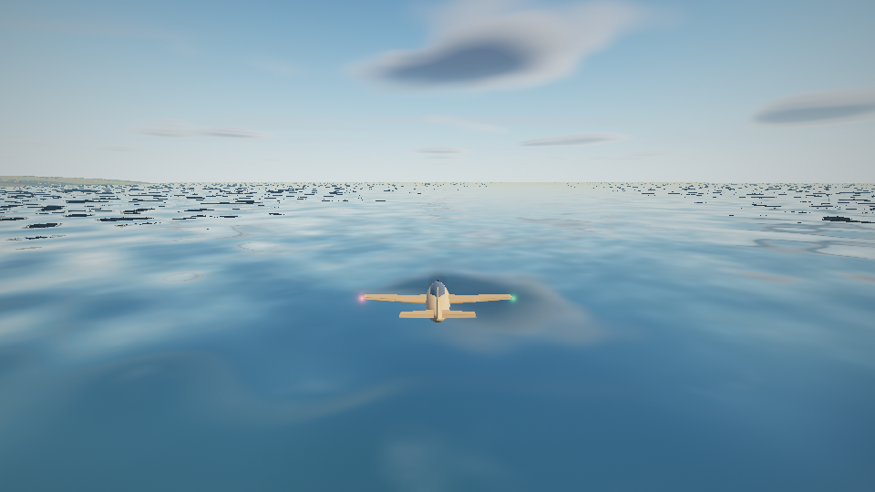

Every image here is a frame the end-to-end suite rendered on its last run.
Nothing is a mock-up, a hand-taken screenshot, or a still touched afterwards:
each frame comes out of the code path the game runs, and each can be rendered
again by name. The suite doubles as this gallery on purpose — a feature nobody
can see is a feature nobody checked.

Read it as an inventory. Between them these frames cover every pipeline, every
settlement kind, every airframe, every screen, the day/night cycle, clear air
and storm, one flight from takeoff to wreck, the trip to space, and the game
on foot. Each frame appears once: the cover above is the only image the page
shows twice.

```sh
./make.py --test              # render the lot (this is also the test suite)
./make.py --shots             # copy them into docs/
build/<rid>/test --list             # every runnable aspect
build/<rid>/test --hq water         # one aspect, at quality
build/<rid>/test --cover --fast     # the whole gallery, accelerated
```

Timings are wall time, measured as each frame renders, on **CPU renderer (no GPU backend)**. They are
what that path cost on the build host and say nothing about yours. On the CPU
renderer a timing spans however many cores the host has, since the path tracer
runs its rows in parallel. Resolution is one constant (`gallery_res` in
`src/test.c`).

## Contents

- [Rendering pipelines](#rendering-pipelines) — 3 frames
- [Graphics levels](#graphics-levels) — 4 frames
- [Time of day](#time-of-day) — 5 frames
- [Weather](#weather) — 2 frames
- [Settlements](#settlements) — 7 frames
- [Powers and territory](#powers-and-territory) — 4 frames
- [One flight, end to end](#one-flight-end-to-end) — 8 frames
- [The worked country](#the-worked-country) — 8 frames
- [Roads and convoys](#roads-and-convoys) — 3 frames
- [The sea, and what works it](#the-sea-and-what-works-it) — 3 frames
- [Where the road meets the line](#where-the-road-meets-the-line) — 2 frames
- [Space](#space) — 8 frames
- [On foot and on rails](#on-foot-and-on-rails) — 5 frames
- [Airframes](#airframes) — 33 frames
- [Renderer features](#renderer-features) — 7 frames
- [Screens](#screens) — 9 frames
- [Frame costs](#frame-costs) — 5 frames
- [Diagnostic captures](#diagnostic-captures) — 12 frames

## Rendering pipelines

Three pipelines draw the same world and are meant to agree about it: a
rasterizer, a path tracer, and the hybrid that traces the environment and
rasterizes everything standing on it. One coastline, once per pipeline, so
the differences are the subject. The GPU and the CPU reference backend get
a set each on a machine with a GL driver; without one there is a single
set, because the two would be the same frame twice.

### Raster, CPU reference backend

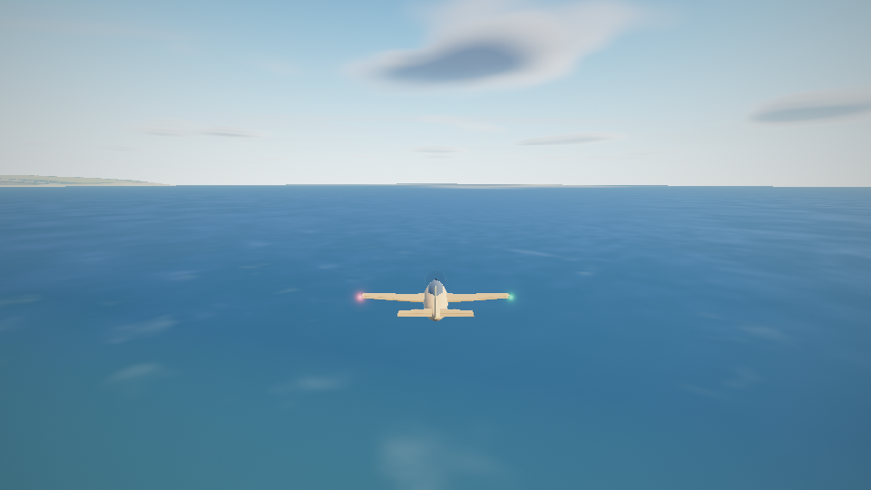

Every surface rasterized, water and sky included

`pipeline_raster_cpu` · raster · 960x540 · ssaa 1 · 1 sample · **1224.1 ms (~0.8 fps)**

### Hybrid, CPU reference backend

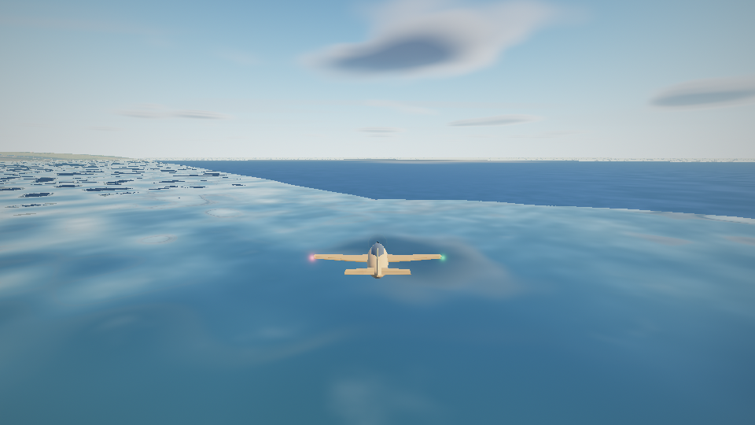

Traced water and sky over rasterized geometry

`pipeline_hybrid_cpu` · hybrid · 960x540 · ssaa 1 · 1 sample · **11361.2 ms (~0.1 fps)**

### Path traced, CPU reference backend


One integrator for the whole frame

`pipeline_pathtraced_cpu` · path-traced · 960x540 · ssaa 1 · 1 sample · **10601.6 ms (~0.1 fps)**


## Graphics levels

The same vista at each rung of the graphics ladder. One setting moves and
everything the renderer can trade moves with it: supersampling, the terrain
and shadow tessellation, how round a hull is lofted, how far the woodland
reaches, whether there is a blade layer at all, and whether the air between
the camera and the world is marched for sun shafts. The bottom rung is a
frame budget for a machine with no GPU; the top one is priced at whatever
it costs.

### Low

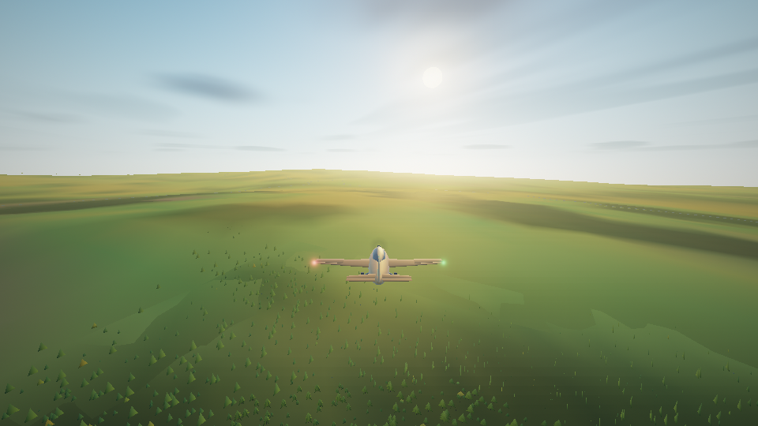

The CPU budget rung: no supersampling, no blade layer, the woodland pulled in, the sky on a lattice

`quality_low` · raster · 960x540 · ssaa 1 · 1 sample · **524.2 ms (~1.9 fps)**

### Medium

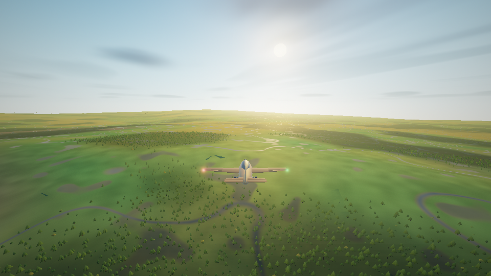

The default rung: shadow cascades, foliage, smooth-lofted hulls, every sky pixel evaluated

`quality_medium` · raster · 960x540 · ssaa 1 · 1 sample · **1413.0 ms (~0.7 fps)**

### High


Dense terrain, wide cascades, supersampling, and the air marched for sun shafts

`quality_high` · raster · 960x540 · ssaa 2 · 1 sample · **3734.0 ms (~0.3 fps)**

### Ultra

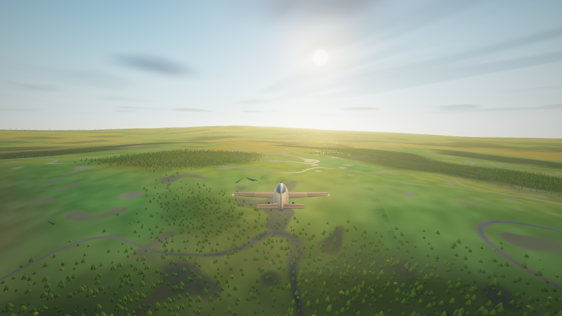

The top rung: 3x supersampling, the roundest hulls, the thickest meadow, the longest march

`quality_ultra` · raster · 960x540 · ssaa 3 · 1 sample · **7744.4 ms (~0.1 fps)**


## Time of day

The same vista around the clock. Nothing here is a colour grade on a
schedule: sky, sun colour, aerial perspective and the light on the ground
all come out of one scattering integral, so dawn is what a long path
through air does to sunlight and night is what is left when it stops.

### Dawn (06:00)

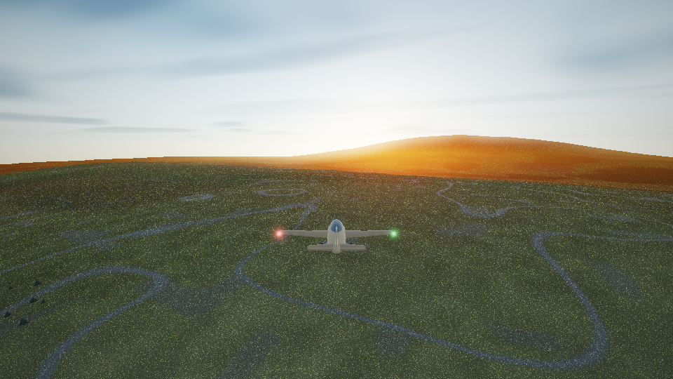

Low sun, long shadows

`tod_dawn` · hybrid · 960x540 · ssaa 1 · 1 sample · **7851.5 ms (~0.1 fps)**

### Noon (12:00)

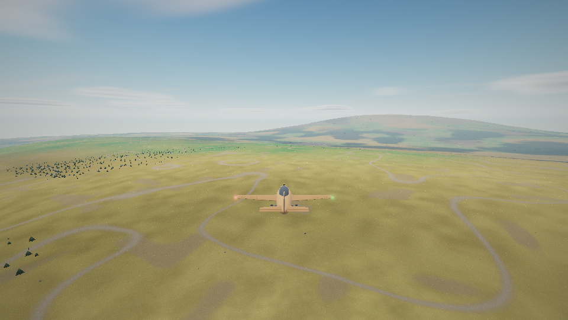

High sun, flat light

`tod_noon` · hybrid · 960x540 · ssaa 1 · 1 sample · **8599.8 ms (~0.1 fps)**

### Dusk (18:24)

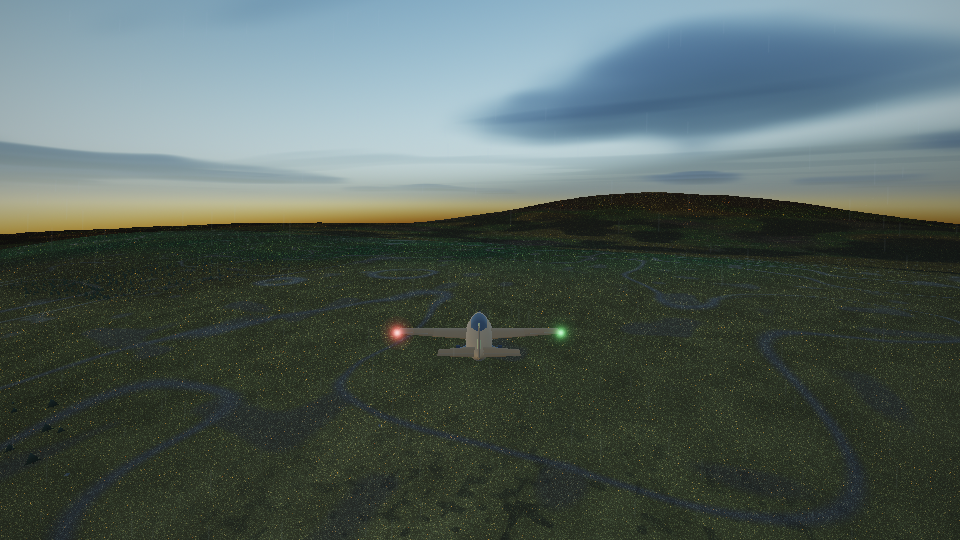

The sun six degrees under, the arch at its warmest

`tod_dusk` · hybrid · 960x540 · ssaa 1 · 1 sample · **7121.5 ms (~0.1 fps)**

### Late twilight (19:00)

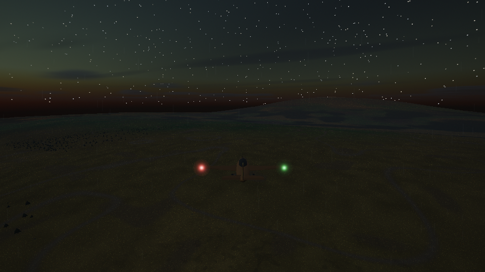

Fifteen degrees under: the last of the arch, and the first stars over it

`tod_twilight` · hybrid · 960x540 · ssaa 1 · 1 sample · **7014.3 ms (~0.1 fps)**

### Night (23:30)

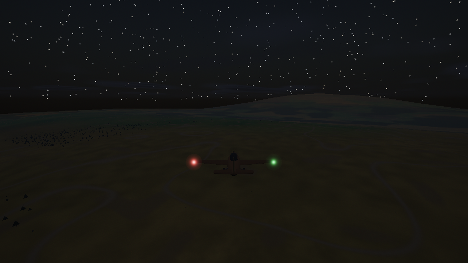

Stars, nav lights, moonlit ground

`tod_night` · hybrid · 960x540 · ssaa 1 · 1 sample · **7788.1 ms (~0.1 fps)**


## Weather

Clear against storm. Weather is simulated, not painted — cells drift, the
belt is permanent, turbulence wears the airframe and a storm can tear it
— and the renderer reads the same state the flight model does.

### Clear air

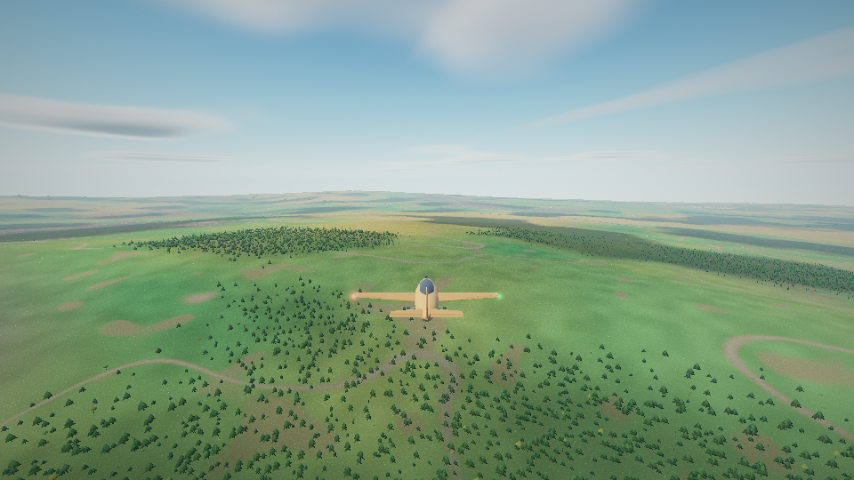

Calm sky, no cell within reach

`weather_clear` · hybrid · 960x540 · ssaa 1 · 1 sample · **9408.1 ms (~0.1 fps)**

### Storm belt

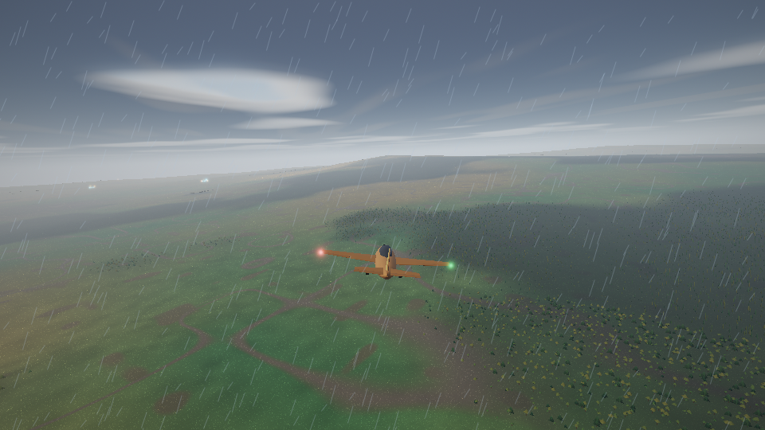

Turbulence, rain, and an airframe taking wear

`weather_storm` · hybrid · 960x540 · ssaa 1 · 1 sample · **9704.2 ms (~0.1 fps)**


## Settlements

Every kind of settlement the world generates, each seen over its own pad.
The architecture, the beacon, the apron and the approach are procedural and
keyed to the site's kind, so these are one generator's answers rather than
a shelf of models.

### Vorgoro (city)

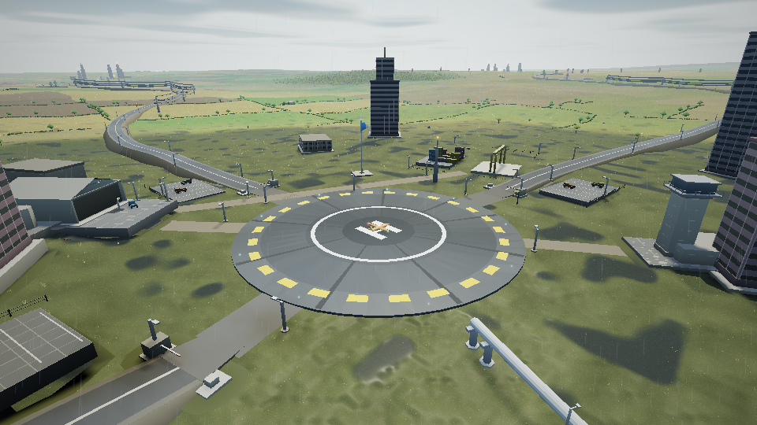

`loc_city` · hybrid · 960x540 · ssaa 1 · 1 sample · **12009.5 ms (~0.1 fps)**

### Auroral (outpost)

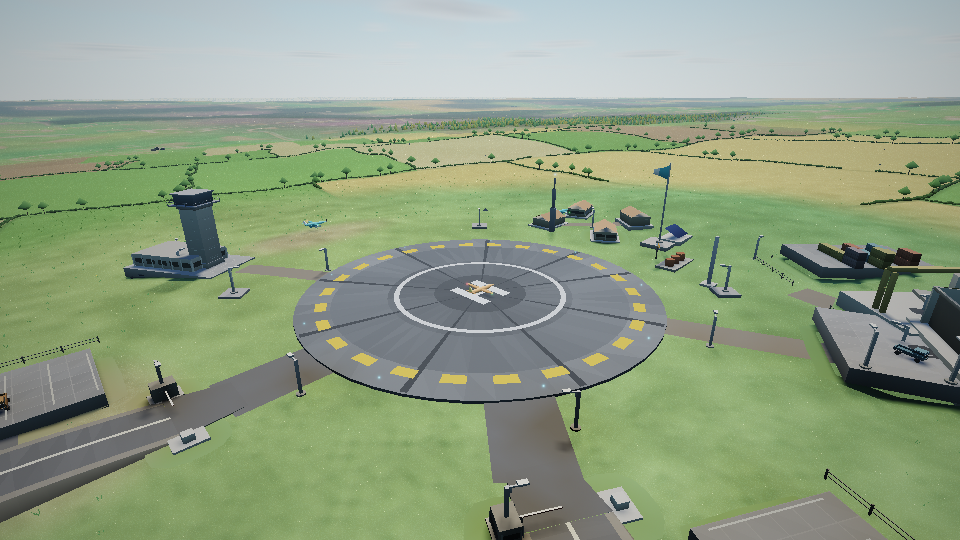

`loc_outpost` · hybrid · 960x540 · ssaa 1 · 1 sample · **11833.3 ms (~0.1 fps)**

### Miragoro (mine)

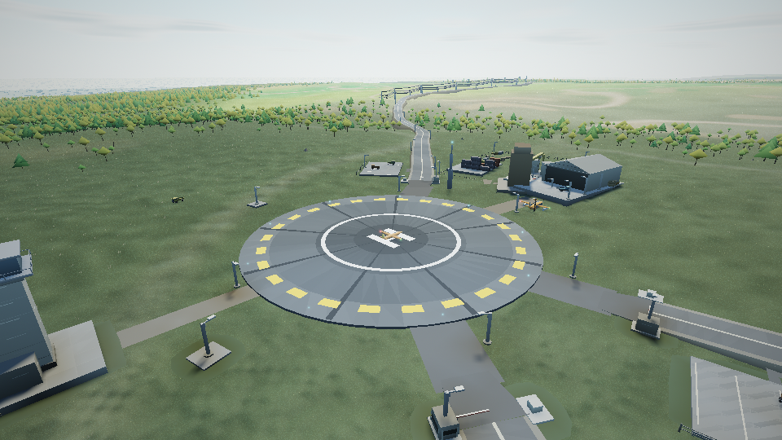

`loc_mine` · hybrid · 960x540 · ssaa 1 · 1 sample · **11948.5 ms (~0.1 fps)**

### Talka (refinery)

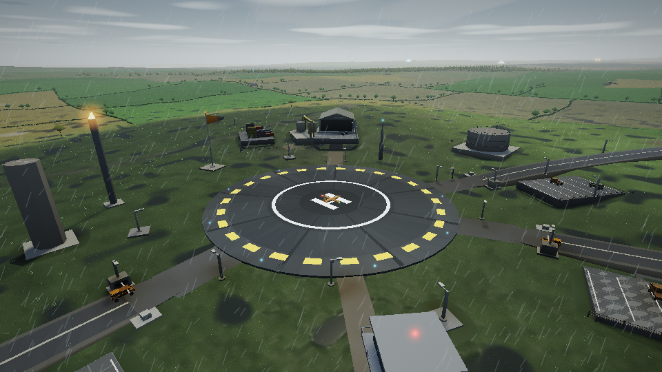

`loc_refinery` · hybrid · 960x540 · ssaa 1 · 1 sample · **11869.2 ms (~0.1 fps)**

### Skybex (ruins)

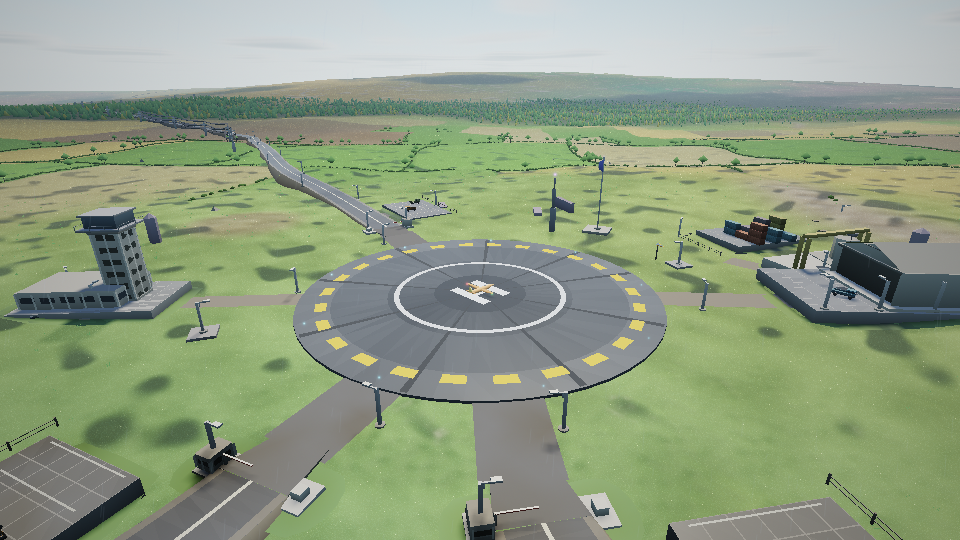

`loc_ruins` · hybrid · 960x540 · ssaa 1 · 1 sample · **12611.5 ms (~0.1 fps)**

### Skyka (skyport)

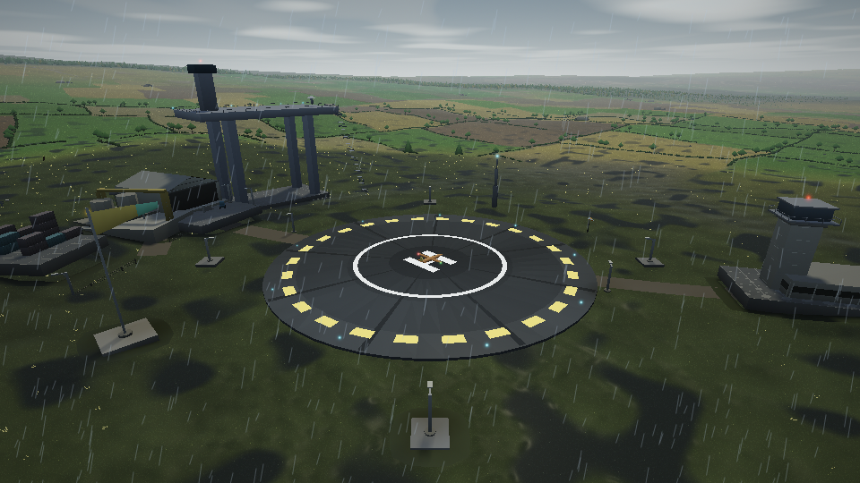

`loc_skyport` · hybrid · 960x540 · ssaa 1 · 1 sample · **12261.9 ms (~0.1 fps)**

### Vorgoro

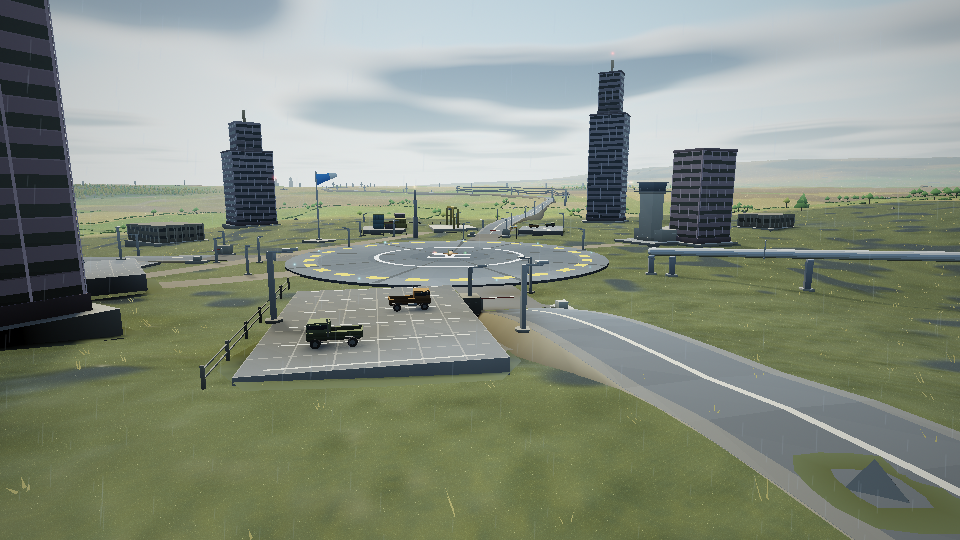

The road in, from behind the gate

`loc_gate` · hybrid · 960x540 · ssaa 1 · 1 sample · **11704.7 ms (~0.1 fps)**


## Powers and territory

Seven powers hold the map between them and are trying to take the rest of
it off each other. None of that is a screen: a settlement flies the colours
of whoever holds it, a second pennant goes up under the first when somebody
is prising it loose, and every aircraft in the sky wears its power's livery.
The chart is where it adds up.

### Held

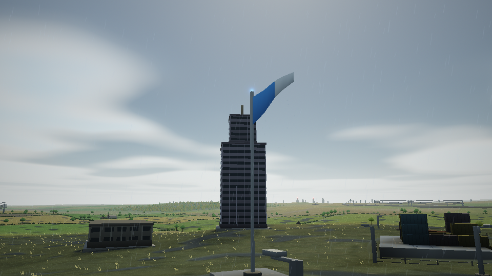

Vorgoro flies the Concord colours, which is how a site says who owns it

`faction_banner` · hybrid · 960x540 · ssaa 1 · 1 sample · **11595.6 ms (~0.1 fps)**

### Contested

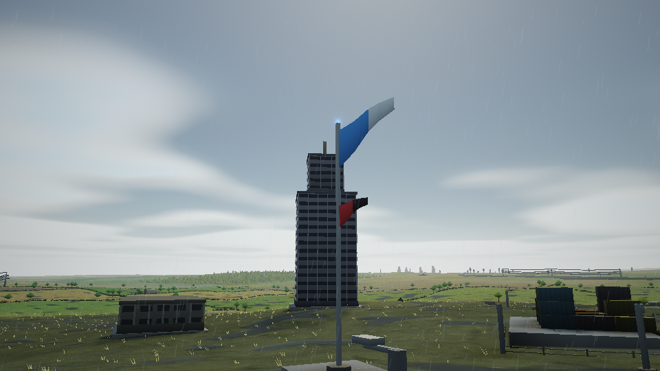

The Corsair Reach are prising Vorgoro off the Concord, and it shows from the air

`faction_contested` · hybrid · 960x540 · ssaa 1 · 1 sample · **10757.3 ms (~0.1 fps)**

### Livery

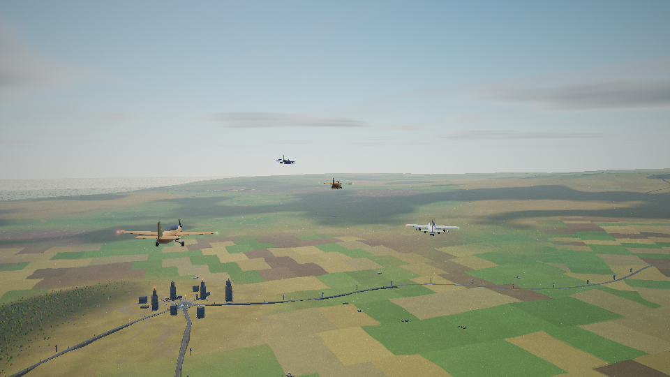

Concord, Foundry and Meridian off the same wing, three of the seven

`faction_livery` · hybrid · 960x540 · ssaa 1 · 1 sample · **10213.1 ms (~0.1 fps)**

### The war map

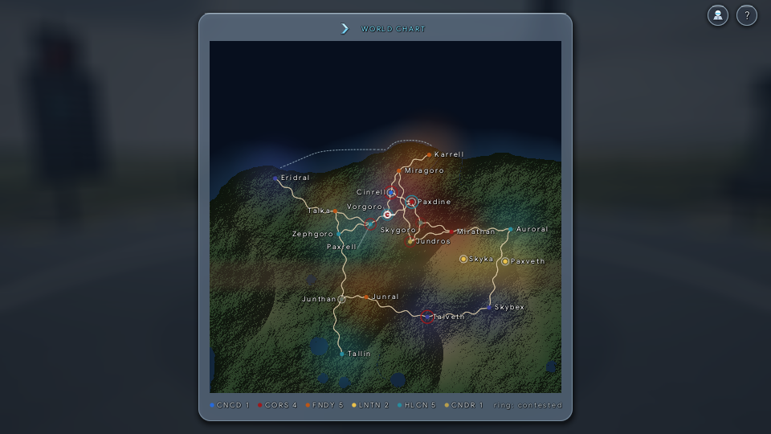

The world chart with holdings washed in their owners' colours and contested fields ringed

`faction_chart` · hybrid · 960x540 · ssaa 1 · 1 sample · **11719.2 ms (~0.1 fps)**


## One flight, end to end

One flight in the order it happened: off the pad, out on the route, onto
the approach, into a fight, and down. These come out of a running game
rather than a pose, so what is on the HUD is what the sim thought.

### Takeoff

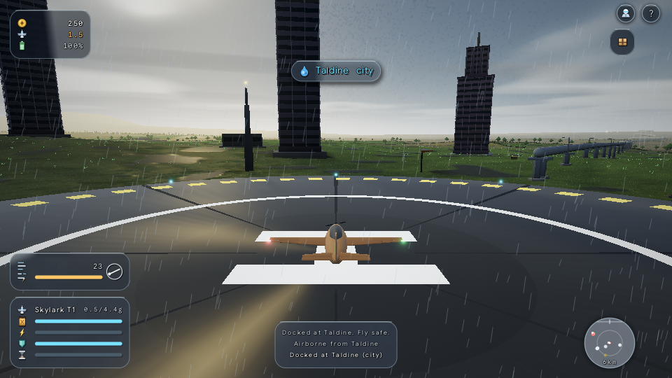

Rolling off the home pad under power

`event_takeoff` · hybrid · 960x540 · ssaa 1 · 1 sample · **12999.8 ms (~0.1 fps)**

### Cruise

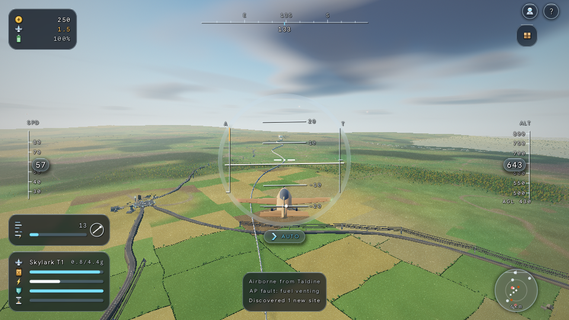

The autopilot holding the route, mid-leg

`event_cruise` · hybrid · 960x540 · ssaa 1 · 1 sample · **10722.4 ms (~0.1 fps)**

### Approach

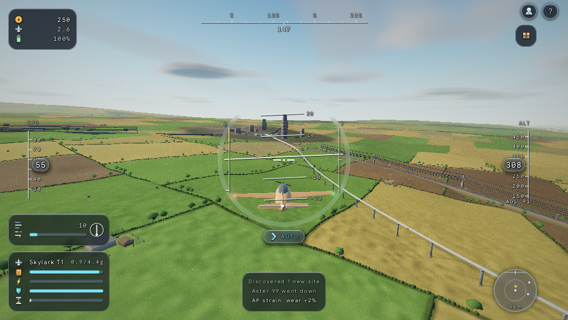

1.4 km out and lined up on the destination pad

`event_approach` · hybrid · 960x540 · ssaa 1 · 1 sample · **11850.8 ms (~0.1 fps)**

### Guns


Firing on a pirate contact

`event_dogfight` · hybrid · 960x540 · ssaa 1 · 1 sample · **11281.1 ms (~0.1 fps)**

### Seekers

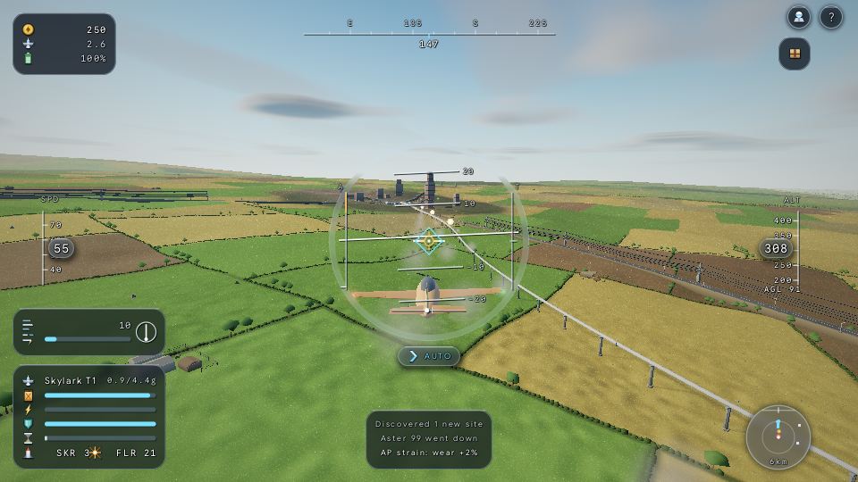

Motors lit, and eight seconds for the other one to answer

`event_seeker` · hybrid · 960x540 · ssaa 1 · 1 sample · **11376.8 ms (~0.1 fps)**

### Flares

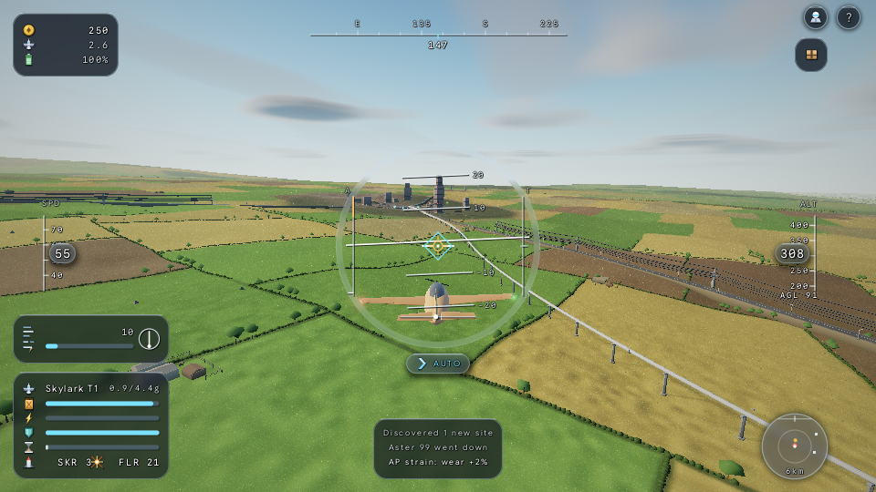

For three seconds these are the hottest thing in the sky

`event_flares` · hybrid · 960x540 · ssaa 1 · 1 sample · **11425.3 ms (~0.1 fps)**

### Impact

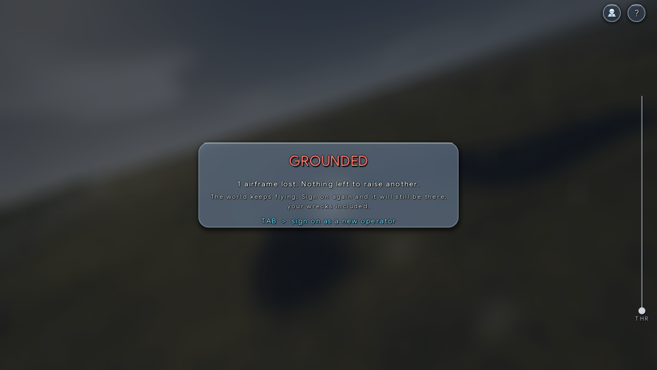

Terrain strike, airframe down

`event_crash` · hybrid · 960x540 · ssaa 1 · 1 sample · **12234.2 ms (~0.1 fps)**

### Wreck

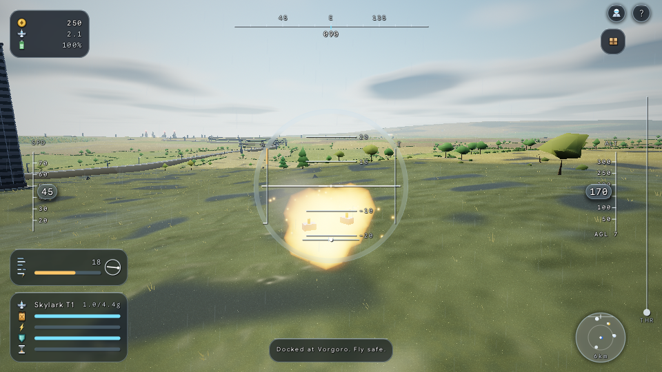

The fireball, and the loadout going out sideways

`event_wreck` · hybrid · 960x540 · ssaa 1 · 1 sample · **11593.1 ms (~0.1 fps)**


## The worked country

The ground between the settlements, which used to be nothing at all: over
four seeds, 70% of the dry land in the chart was more than two kilometres
from a settlement, a road or the rail, and half of it grew nothing. Every
settlement encloses the ground around it now — parcels with a crop each,
a hedge or a wall along every boundary, farms in the corners of the fields
and lanes out to the road — and the wood gives way to it, because a field
is cleared ground. Three ranges, one parish, because that is what the
feature is: a pattern from cruise, a hedge on the approach, and a building
when you are on top of it.

### A settlement's parish from cruise

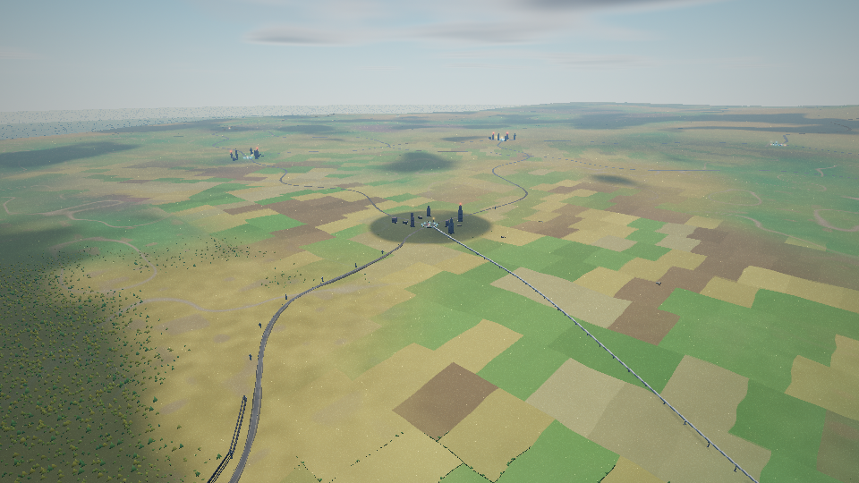

Parcels with a crop each, hedged, thinning out into open country the way the belt does

`country_parish` · hybrid · 960x540 · ssaa 1 · 1 sample · **11832.6 ms (~0.1 fps)**

### The same fields from a hundred feet

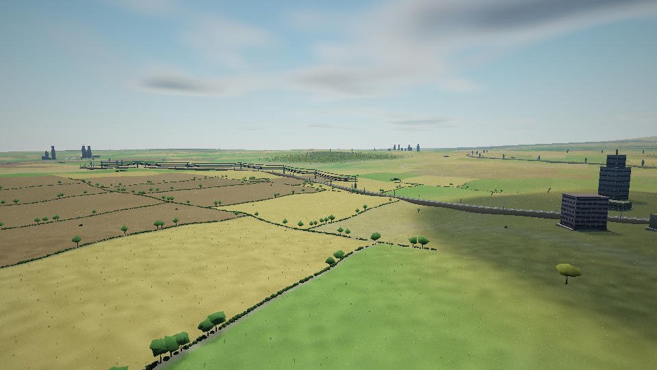

Thorn along every boundary, a standard in every sixteenth of it, and no wood on ploughed ground

`country_enclosure` · hybrid · 960x540 · ssaa 1 · 1 sample · **10862.0 ms (~0.1 fps)**

### A steading in the corner of a field

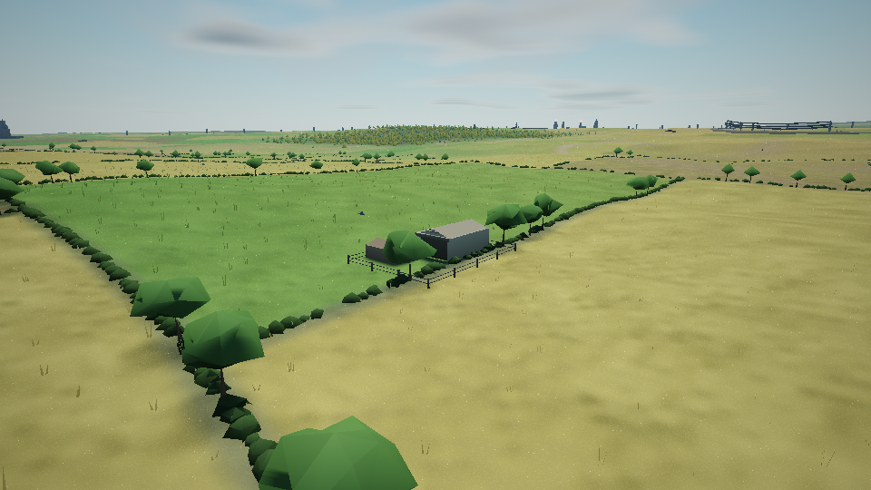

Barn, byre and a fenced yard, square to the enclosure it works, with a lane out to the road

`country_steading` · hybrid · 960x540 · ssaa 1 · 1 sample · **11704.5 ms (~0.1 fps)**

### The line beside a road, from cruise

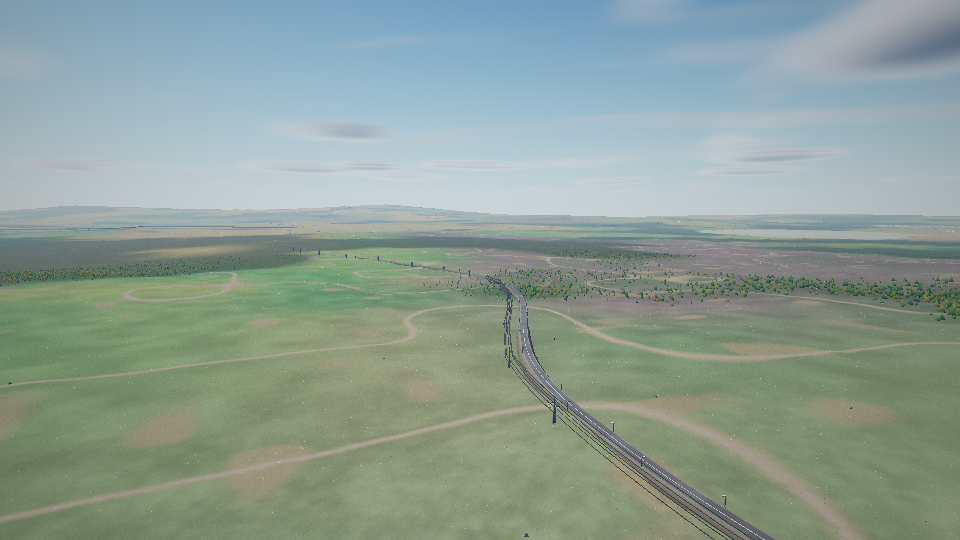

A mast every couple of hundred metres of carriageway, carrying the ground the parish does not reach

`country_corridor` · hybrid · 960x540 · ssaa 1 · 1 sample · **10131.9 ms (~0.1 fps)**

### A tower and the span out of it

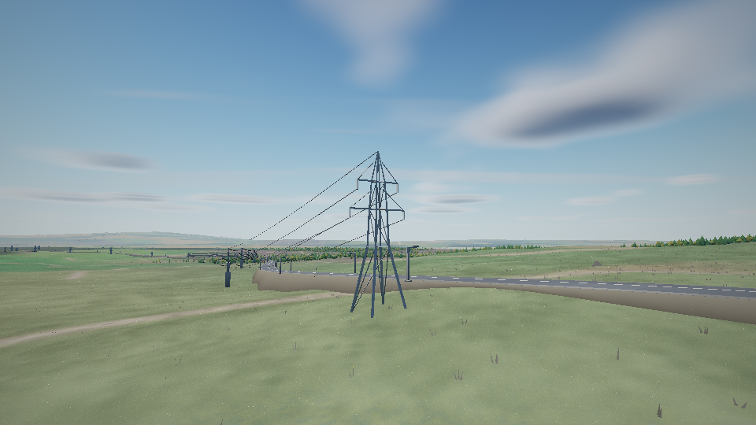

Four legs on four footings, two arms, and five conductors hanging in a catenary to the next mast down the road

`country_pylon` · hybrid · 960x540 · ssaa 1 · 1 sample · **10461.1 ms (~0.1 fps)**

### A river from cruise

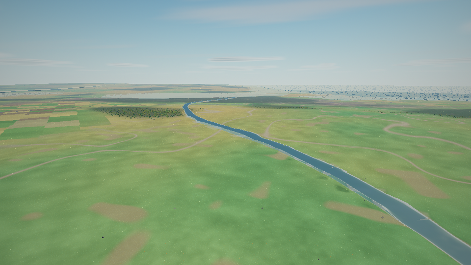

Traced by steepest descent off a flooded lattice, cut into the heightfield rather than drawn on it, and followed home the way a pilot would

`water_river` · hybrid · 960x540 · ssaa 1 · 1 sample · **12866.9 ms (~0.1 fps)**

### The same water from a hundred and fifty feet

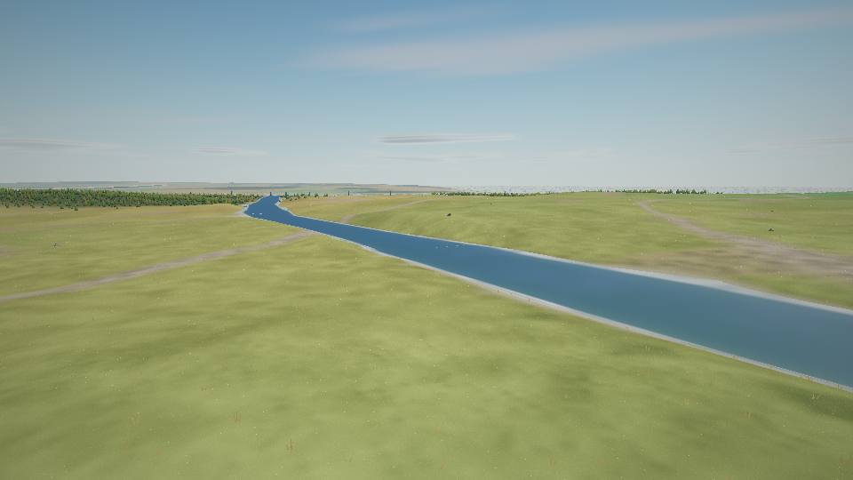

A channel with banks, a shore of its own and the sea's whole water material on it, three hundred metres above the sea

`water_channel` · hybrid · 960x540 · ssaa 1 · 1 sample · **13731.4 ms (~0.1 fps)**

### A lake

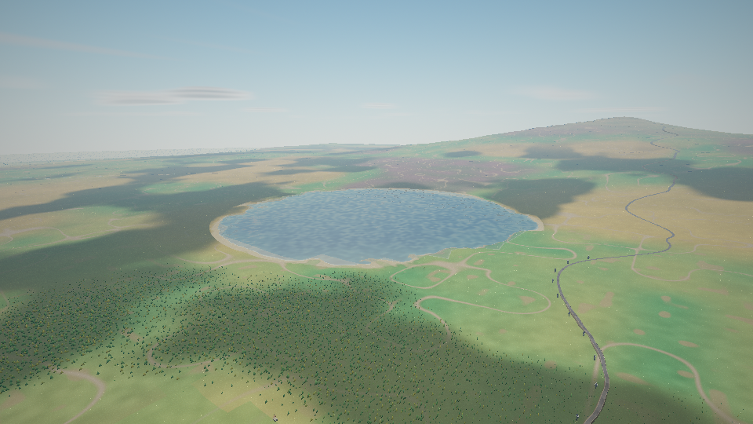

A basin the descent dead-ended in, filled to the lowest lip it could find, with the shoreline the terrain's own contour rather than the disc it is bounded by

`water_lake` · hybrid · 960x540 · ssaa 1 · 1 sample · **9841.7 ms (~0.1 fps)**


## Roads and convoys

The hauling roads and the freight on them. A column is a route you can
follow from altitude and a target you can come down on, and it shoots
back — so both frames are the same column, seen the two ways.

### The road

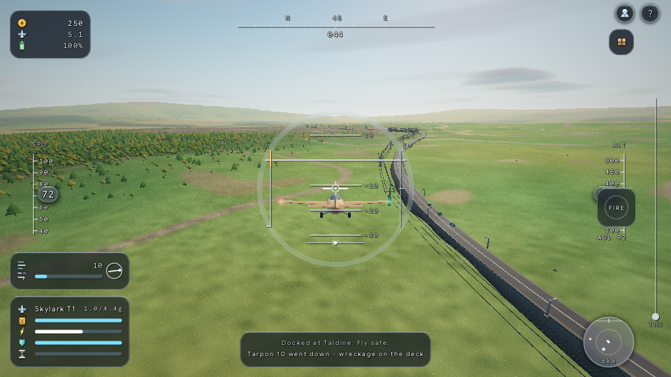

A hauling route between two settlements, and the column running it

`convoy_road` · hybrid · 960x540 · ssaa 1 · 1 sample · **11931.7 ms (~0.1 fps)**

### The same road at night

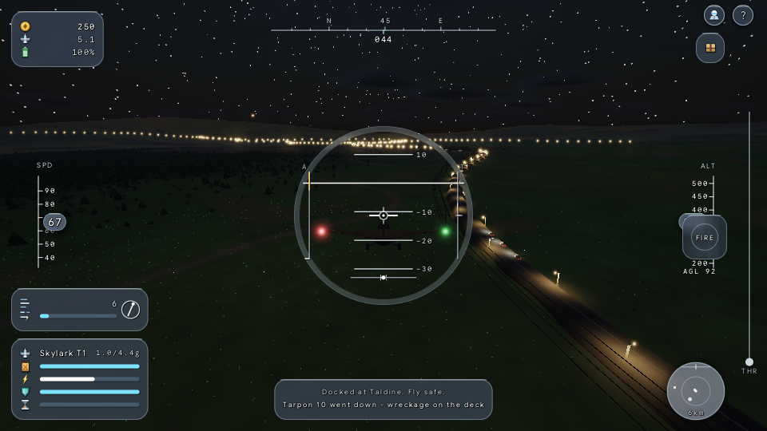

Lit its whole length, both verges, all the way between the two settlements

`convoy_road_night` · hybrid · 960x540 · ssaa 1 · 1 sample · **8652.7 ms (~0.1 fps)**

### The pass

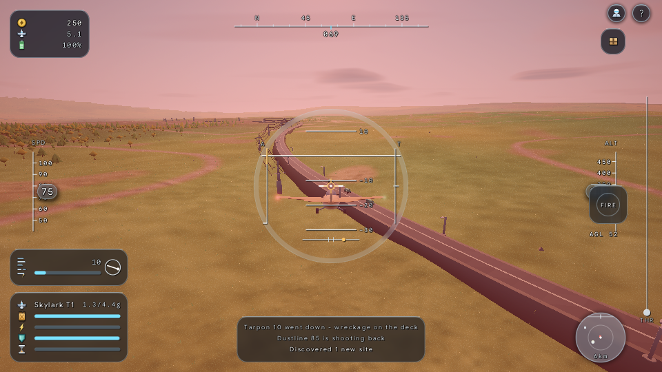

An escorted column shedding a truck; it shoots back, and what it drops is worth what it cost

`convoy_strafe` · hybrid · 960x540 · ssaa 1 · 1 sample · **11742.7 ms (~0.1 fps)**


## The sea, and what works it

A third of the chart is water, and until there was a lane on it the only
things ever drawn out there were the rail's piers and a road's causeway.
The survey is the road network's, read the other way round — water is the
cheap ground and land is what the line may not cross — so a lane goes
round a headland for the same reason a road goes round a bay. What runs
on it is the same freight a column carries, worth the same to the market
and worth robbing for the same reasons; the two ends of it are quays, and
the fairway between them is marked.

### The lane

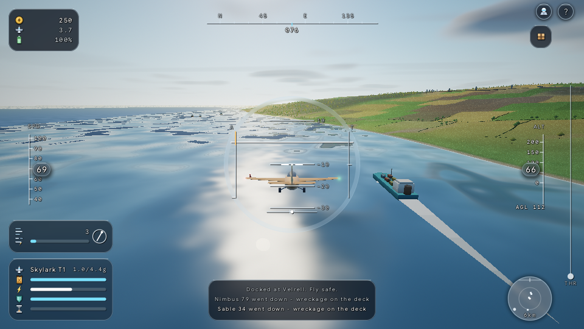

A shipping route between two harbours, and the hull running it, with her wake behind her and the marks off her side

`sea_lane` · hybrid · 960x540 · ssaa 1 · 1 sample · **10069.3 ms (~0.1 fps)**

### The same lane at night

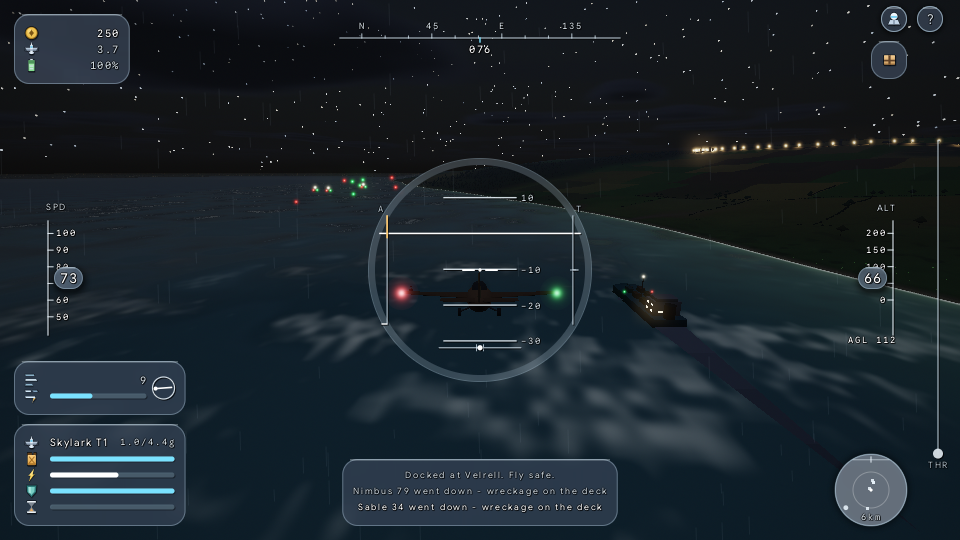

Lateral marks occulting either side of the fairway, and a hull under her own lights

`sea_lane_night` · hybrid · 960x540 · ssaa 1 · 1 sample · **8986.7 ms (~0.1 fps)**

### The quay

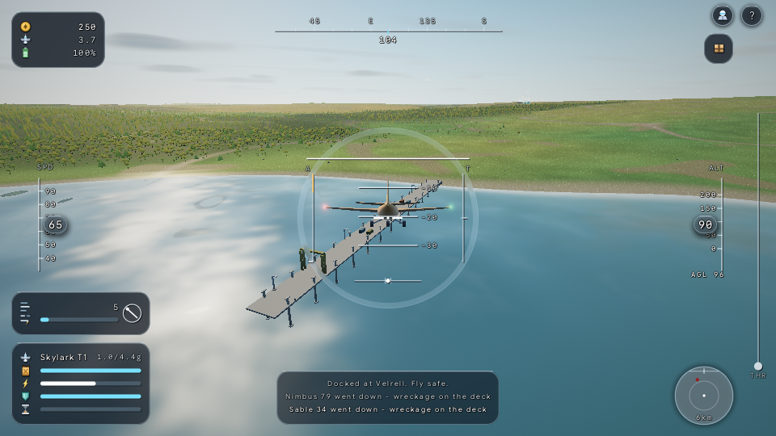

Where a settlement meets the water: a deck on piles out to a berth deep enough to lie in, with the crane over it

`sea_quay` · hybrid · 960x540 · ssaa 1 · 1 sample · **10351.1 ms (~0.1 fps)**


## Where the road meets the line

The two ground networks are laid by the same surveyor and priced to keep
out of each other's way, so most worlds have only a handful of places
where they touch at all. Where one does, it is built rather than drawn:
the span is widened to clear the right of way, the bents move out to the
verges, the road ducks under with the headroom a loaded lorry needs, and
the structure lights the carriageway it stands over.

### The crossing

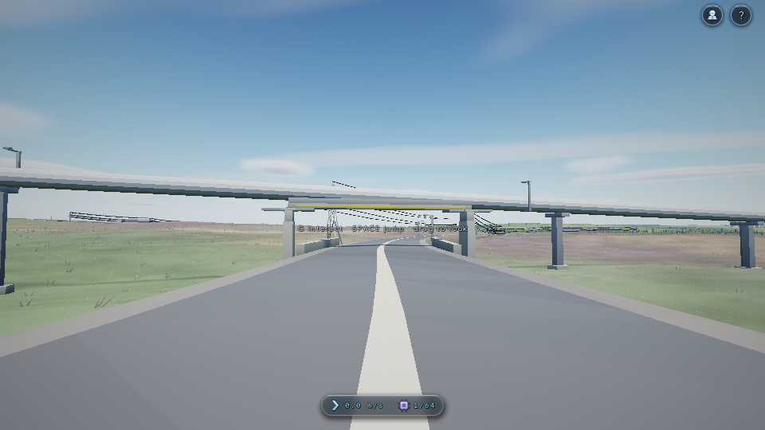

The guideway carried over a road on its own portal, the span widened to clear the right of way and the bents moved out to the verges

`rail_crossing` · hybrid · 960x540 · ssaa 1 · 1 sample · **10298.5 ms (~0.1 fps)**

### The same crossing after dark

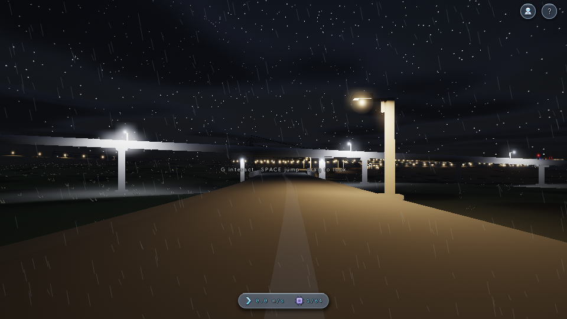

The road in sodium, the guideway in white, and the structure lighting the carriageway under it

`rail_crossing_night` · hybrid · 960x540 · ssaa 1 · 1 sample · **8883.3 ms (~0.1 fps)**


## Space

The trip up, and the thing already up there. Space is gated by physics
rather than by permission: every engine but the rocket makes thrust out of
air, and lift goes the same way, so the five-part spaceframe is the only
build that leaves. All five parts show on the hull. The saucer at the top
of the ladder is weightless — it holds station where an orbit would have
carried it out of the world.

### The stack

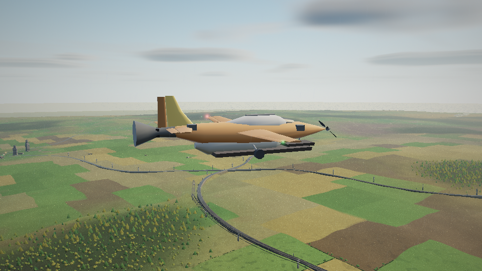

Motor, propellant tank, RCS, aeroshell and pressure cabin fitted

`space_stack` · hybrid · 960x540 · ssaa 1 · 1 sample · **12163.1 ms (~0.1 fps)**

### Ascent

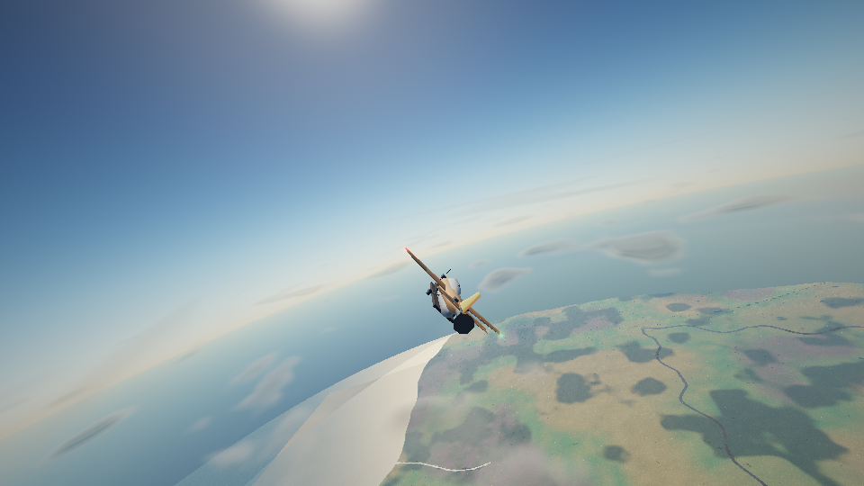

Under the motor at 11 km, nose up on the gravity turn

`space_ascent` · hybrid · 960x540 · ssaa 1 · 1 sample · **8530.7 ms (~0.1 fps)**

### The edge

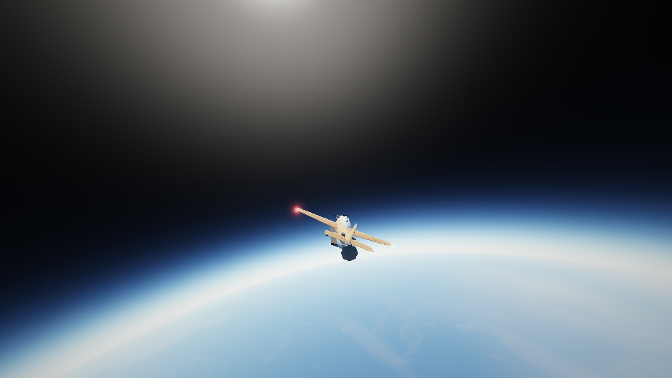

62 km, above the air, the sky black overhead and the limb lit edge-on

`space_edge` · hybrid · 960x540 · ssaa 1 · 1 sample · **7093.3 ms (~0.1 fps)**

### Orbit

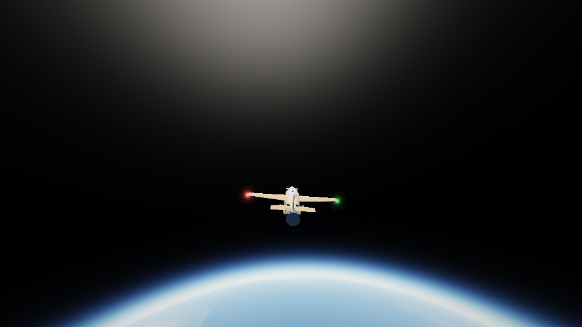

148 km at 2280 m/s, on a trajectory rather than in flight

`space_orbit` · hybrid · 960x540 · ssaa 1 · 1 sample · **6787.9 ms (~0.1 fps)**

### Contact

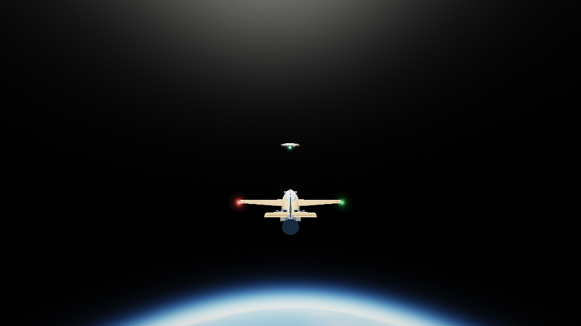

A saucer holding station above the line, seen from a converted hauler

`space_contact` · hybrid · 960x540 · ssaa 1 · 1 sample · **7871.0 ms (~0.1 fps)**

### The saucer

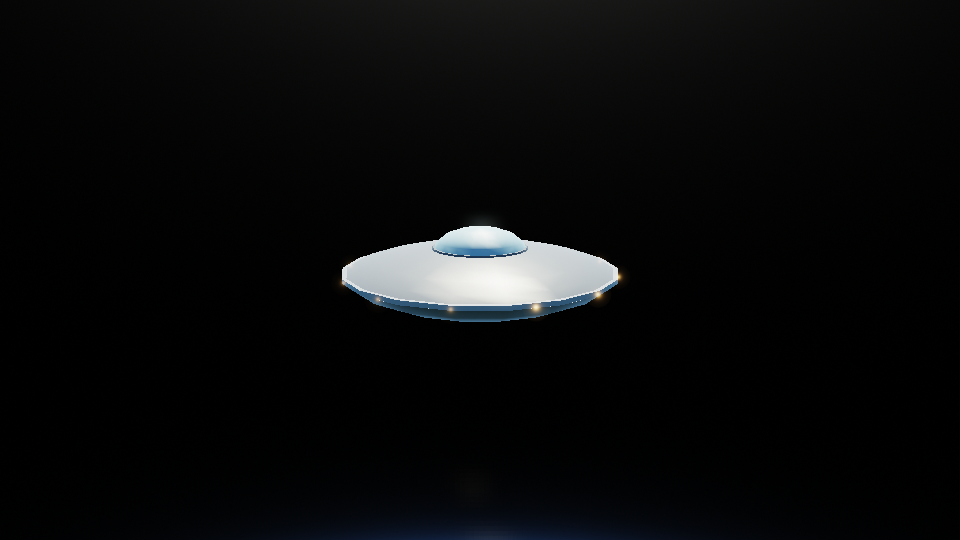

Weightless, sealed, and built out of no physics the rest of the game uses

`space_saucer` · hybrid · 960x540 · ssaa 1 · 1 sample · **9030.9 ms (~0.1 fps)**

### Re-entry

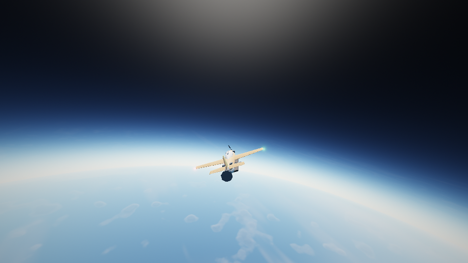

44 km, nose down on the shield, hull heat at 0.72 of the limit

`space_reentry` · hybrid · 960x540 · ssaa 1 · 1 sample · **7459.9 ms (~0.1 fps)**

### The panel

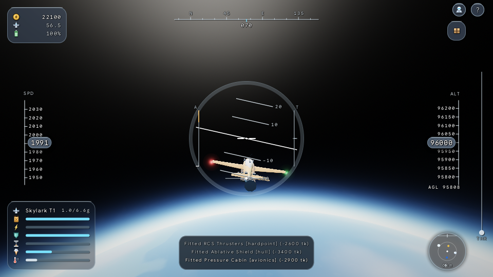

Propellant and hull heat in vacuum, two rows an aeroplane never shows

`space_hud` · hybrid · 960x540 · ssaa 1 · 1 sample · **7350.2 ms (~0.1 fps)**


## On foot and on rails

The game outside an aircraft: walking a crash site, picking scattered
modules back up, jumping, and riding the rail between two settlements.

### Salvage

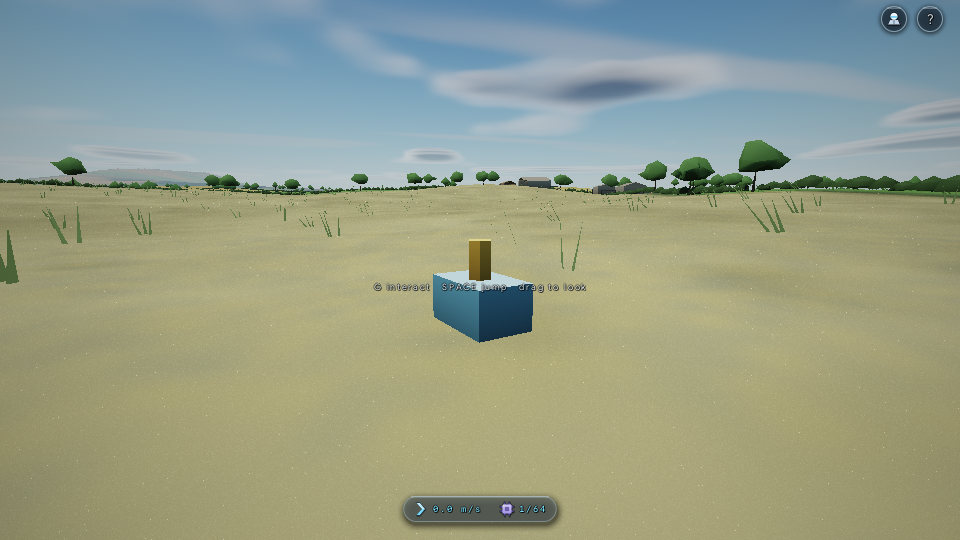

On foot beside a scattered module, G to recover it

`ground_pickup` · hybrid · 960x540 · ssaa 1 · 1 sample · **10548.7 ms (~0.1 fps)**

### Bunny-hop

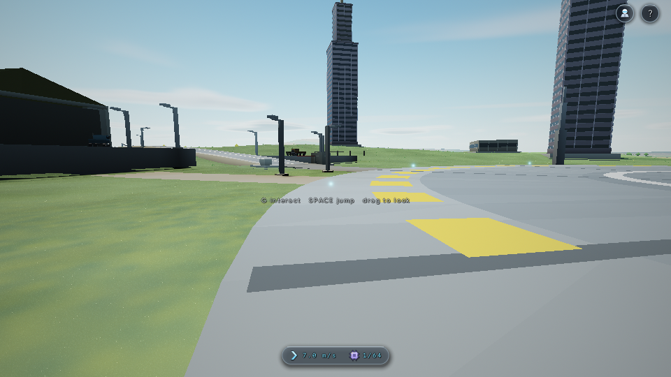

Horizontal speed carried through the jump, seen first-person

`ground_bunnyhop` · hybrid · 960x540 · ssaa 1 · 1 sample · **10716.9 ms (~0.1 fps)**

### Rail approach

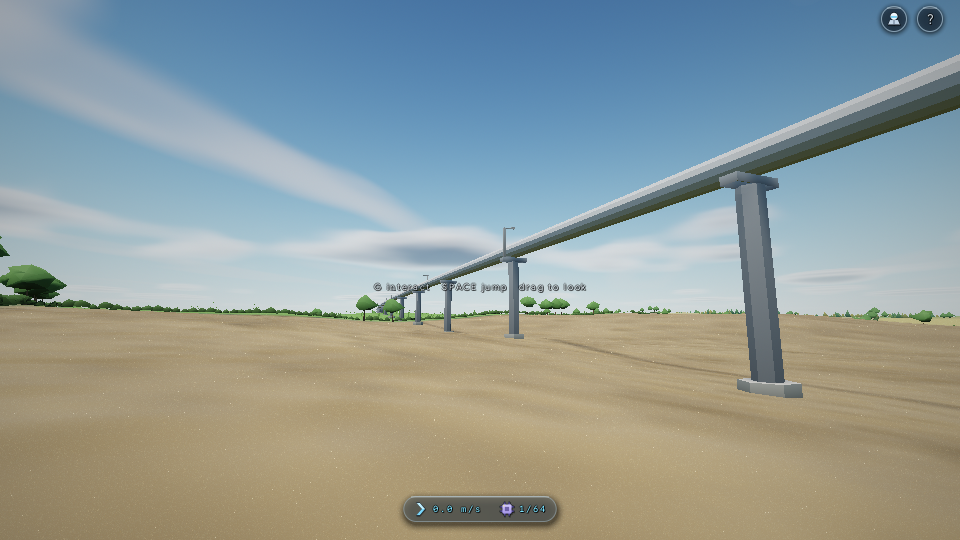

The one-way ground rail, boardable anywhere along its route

`rail_approach` · hybrid · 960x540 · ssaa 1 · 1 sample · **9772.8 ms (~0.1 fps)**

### Pod ride

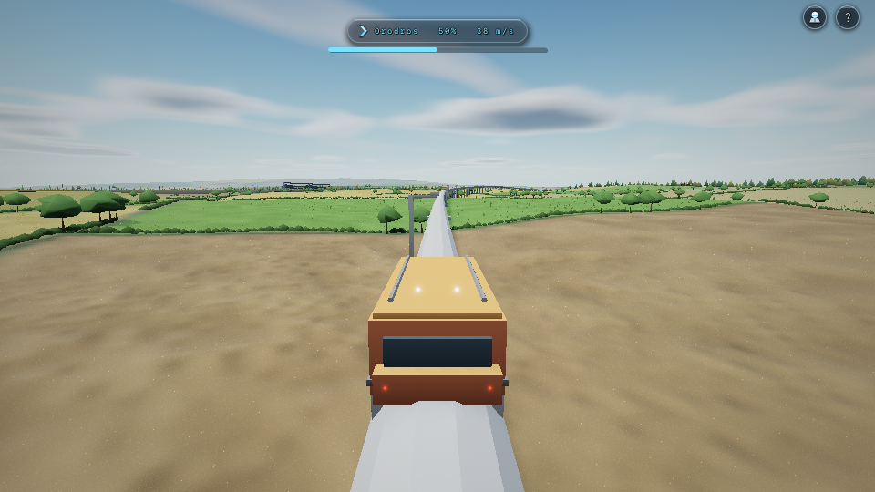

The ride camera trailing the pod along the pipe

`rail_ride` · hybrid · 960x540 · ssaa 1 · 1 sample · **10872.1 ms (~0.1 fps)**

### Crash site

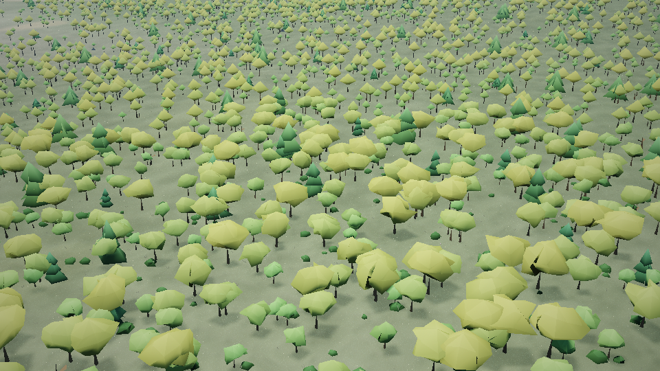

Fitted modules scattered across dry ground, waiting to be recovered

`ground_crash` · hybrid · 960x540 · ssaa 1 · 1 sample · **10884.4 ms (~0.1 fps)**


## Airframes

Each airframe on a studio plate, four views apiece, stock and under two
loadouts. Fitted modules change the model as well as the simulation, so a
loadout is visible on the hull.

### Antiphon V1 (stock)

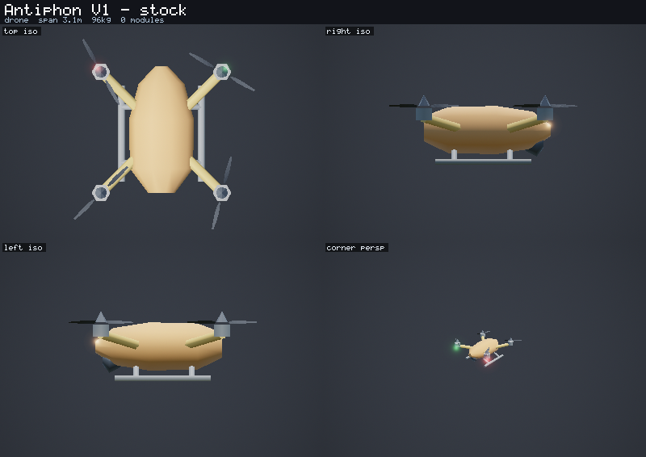

Drone, span 3.1 m, 96 kg; fits: as delivered

`airframe_antiphon_0` · raster · 800x566 · ssaa 1 · 1 sample · **41.4 ms (~24.1 fps)**

### Antiphon V1 (loadout A)

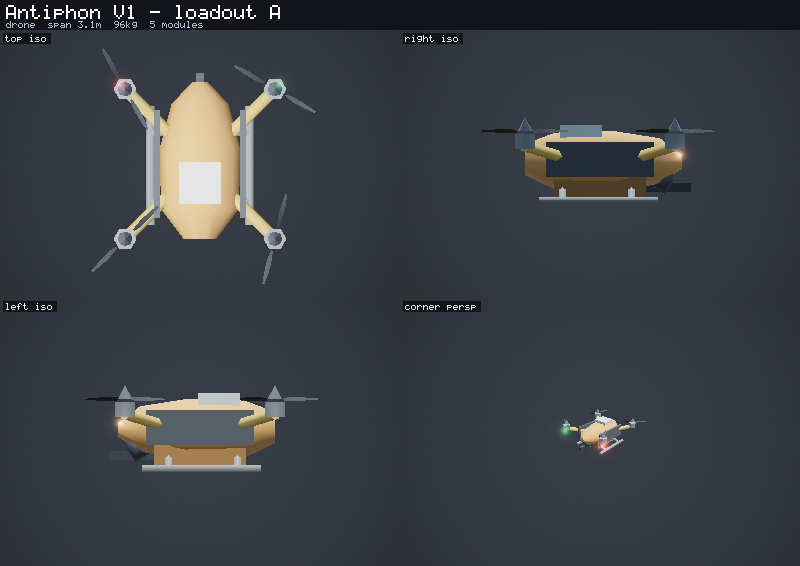

Drone, span 3.1 m, 96 kg; fits: Tuned Engine, Gun Pod, Cargo Racks, Radar Array, Armor Plating

`airframe_antiphon_1` · raster · 800x566 · ssaa 1 · 1 sample · **43.6 ms (~23.0 fps)**

### Antiphon V1 (loadout B)

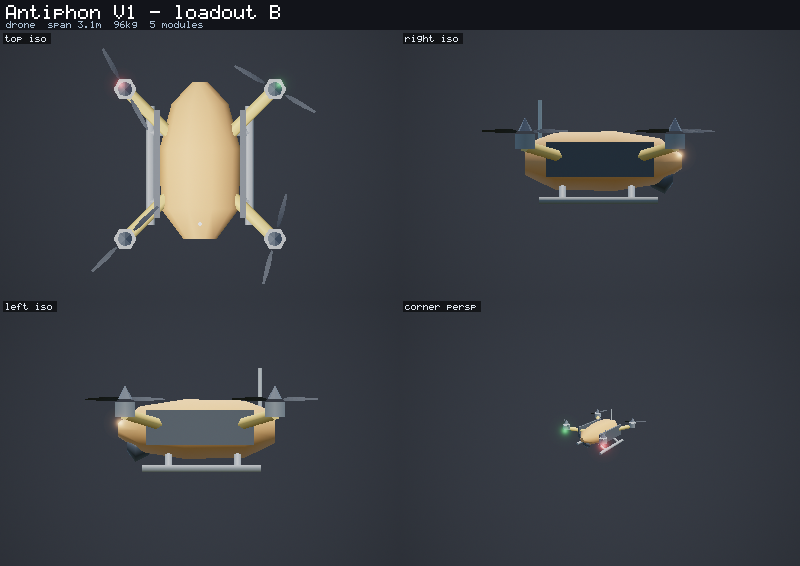

Drone, span 3.1 m, 96 kg; fits: Sprint Turbine, Lumen Emitter, Censer Pod, Ghost Box, Storm Shroud

`airframe_antiphon_2` · raster · 800x566 · ssaa 1 · 1 sample · **40.1 ms (~24.9 fps)**

### Ashjack T6 (stock)

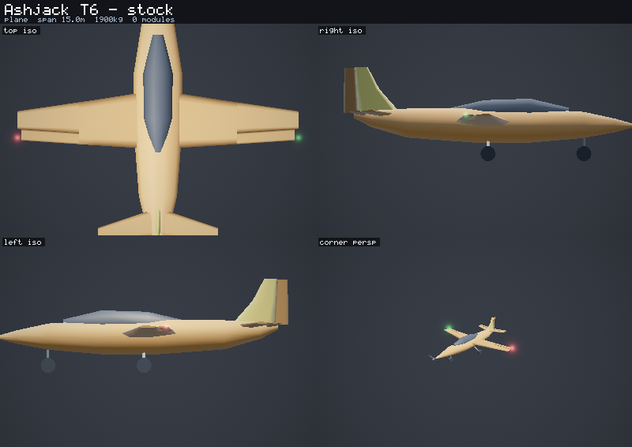

Plane, span 15.0 m, 1900 kg; fits: as delivered

`airframe_ashjack_0` · raster · 800x566 · ssaa 1 · 1 sample · **44.2 ms (~22.6 fps)**

### Ashjack T6 (loadout A)

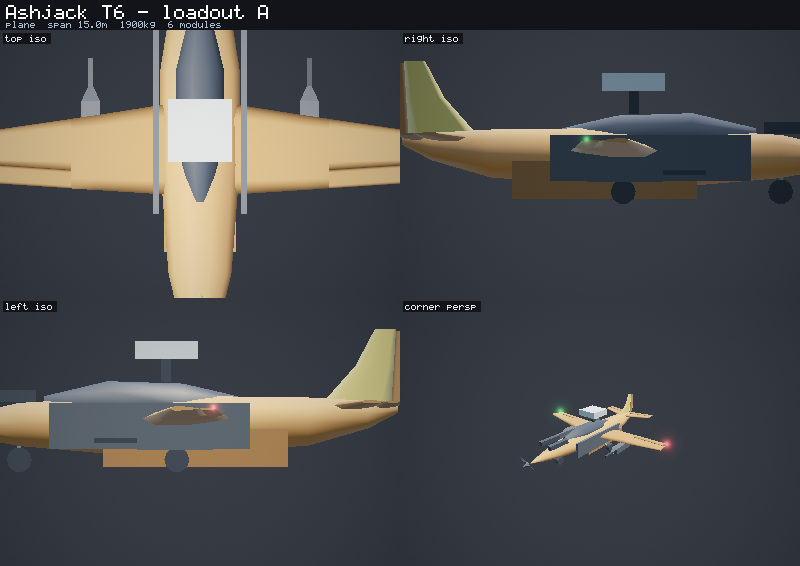

Plane, span 15.0 m, 1900 kg; fits: Tuned Engine, Extended Wings, Gun Pod, Cargo Racks, Radar Array, Armor Plating

`airframe_ashjack_1` · raster · 800x566 · ssaa 1 · 1 sample · **47.9 ms (~20.9 fps)**

### Ashjack T6 (loadout B)

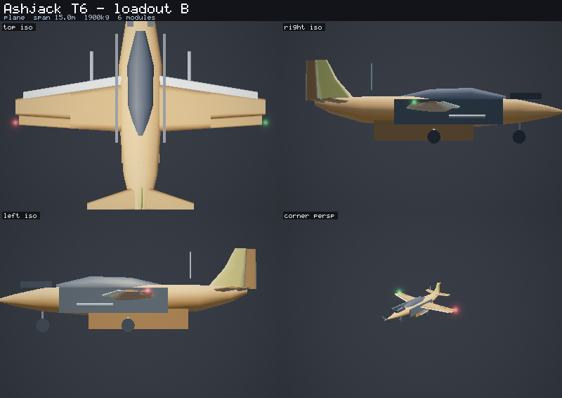

Plane, span 15.0 m, 1900 kg; fits: Sprint Turbine, Salvage Grapple, Lumen Emitter, Censer Pod, Ghost Box, Storm Shroud

`airframe_ashjack_2` · raster · 800x566 · ssaa 1 · 1 sample · **43.6 ms (~22.9 fps)**

### Condor H4 (stock)

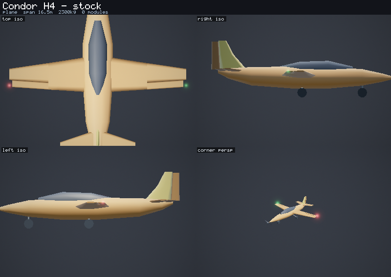

Plane, span 16.5 m, 2300 kg; fits: as delivered

`airframe_condor_0` · raster · 800x566 · ssaa 1 · 1 sample · **41.9 ms (~23.9 fps)**

### Condor H4 (loadout A)

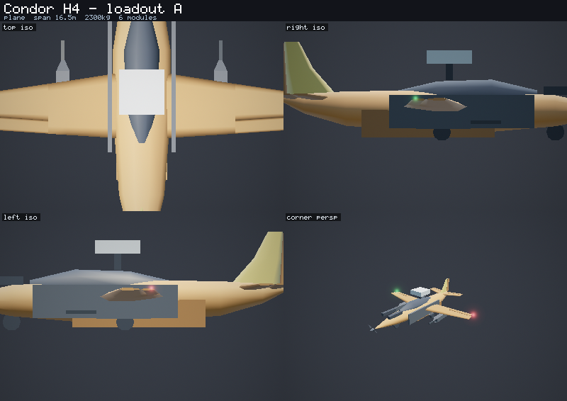

Plane, span 16.5 m, 2300 kg; fits: Tuned Engine, Extended Wings, Gun Pod, Cargo Racks, Radar Array, Armor Plating

`airframe_condor_1` · raster · 800x566 · ssaa 1 · 1 sample · **47.3 ms (~21.1 fps)**

### Condor H4 (loadout B)

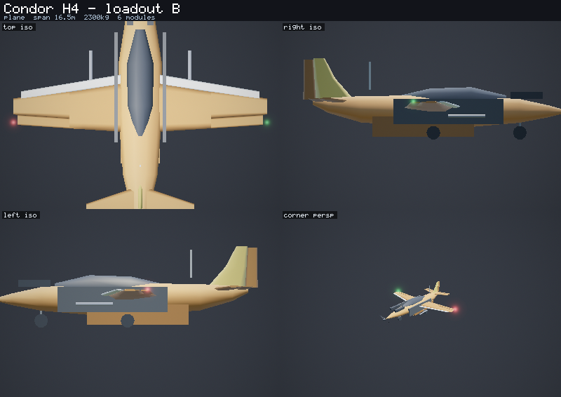

Plane, span 16.5 m, 2300 kg; fits: Sprint Turbine, Salvage Grapple, Lumen Emitter, Censer Pod, Ghost Box, Storm Shroud

`airframe_condor_2` · raster · 800x566 · ssaa 1 · 1 sample · **44.9 ms (~22.3 fps)**

### Courser M5 (stock)

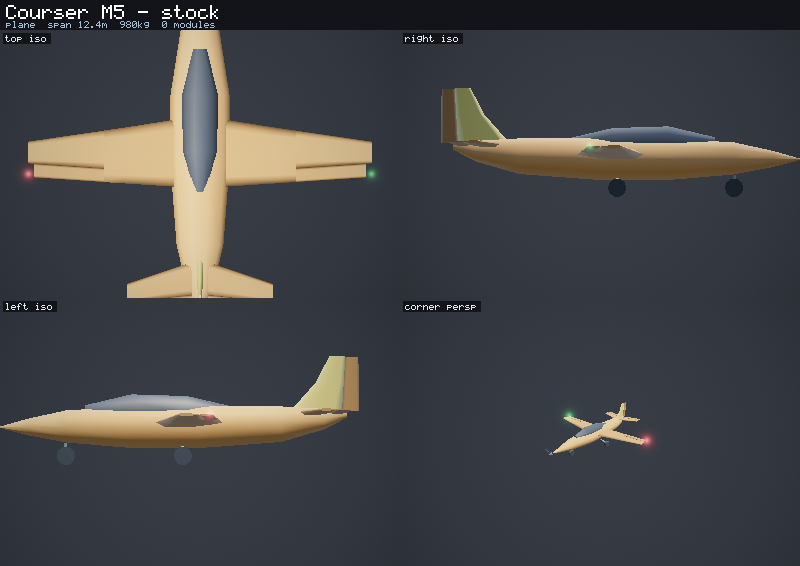

Plane, span 12.4 m, 980 kg; fits: as delivered

`airframe_courser_0` · raster · 800x566 · ssaa 1 · 1 sample · **42.3 ms (~23.6 fps)**

### Courser M5 (loadout A)


Plane, span 12.4 m, 980 kg; fits: Tuned Engine, Extended Wings, Gun Pod, Cargo Racks, Radar Array, Armor Plating

`airframe_courser_1` · raster · 800x566 · ssaa 1 · 1 sample · **44.9 ms (~22.3 fps)**

### Courser M5 (loadout B)


Plane, span 12.4 m, 980 kg; fits: Sprint Turbine, Salvage Grapple, Lumen Emitter, Censer Pod, Ghost Box, Storm Shroud

`airframe_courser_2` · raster · 800x566 · ssaa 1 · 1 sample · **44.6 ms (~22.4 fps)**

### Dragonfly Q4 (stock)

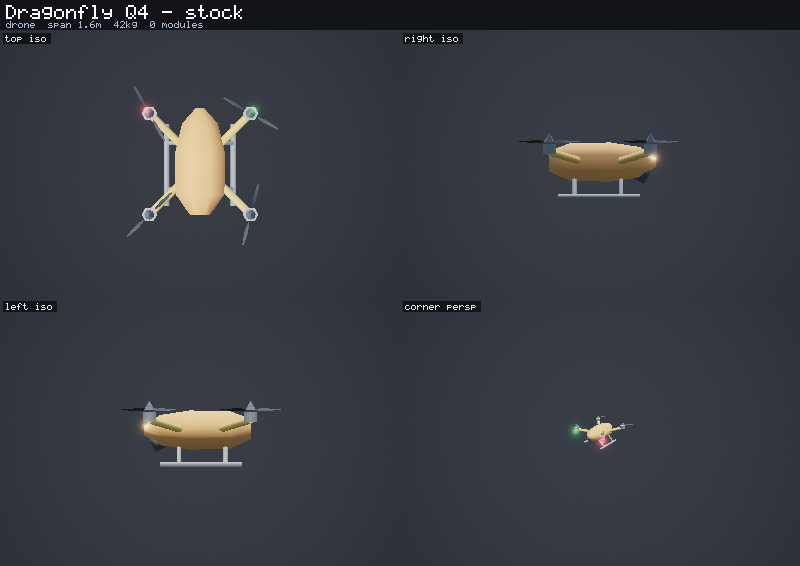

Drone, span 1.6 m, 42 kg; fits: as delivered

`airframe_dragonfly_0` · raster · 800x566 · ssaa 1 · 1 sample · **39.3 ms (~25.5 fps)**

### Dragonfly Q4 (loadout A)

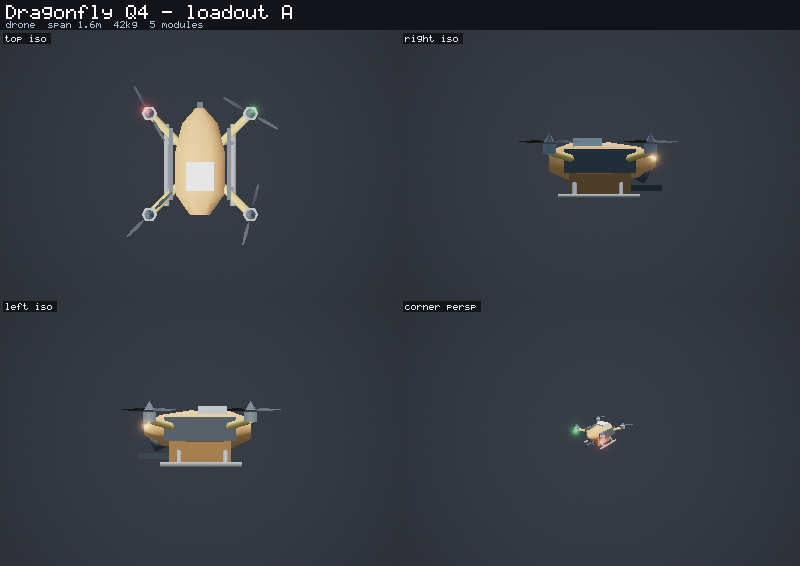

Drone, span 1.6 m, 42 kg; fits: Tuned Engine, Gun Pod, Cargo Racks, Radar Array, Armor Plating

`airframe_dragonfly_1` · raster · 800x566 · ssaa 1 · 1 sample · **39.6 ms (~25.3 fps)**

### Dragonfly Q4 (loadout B)

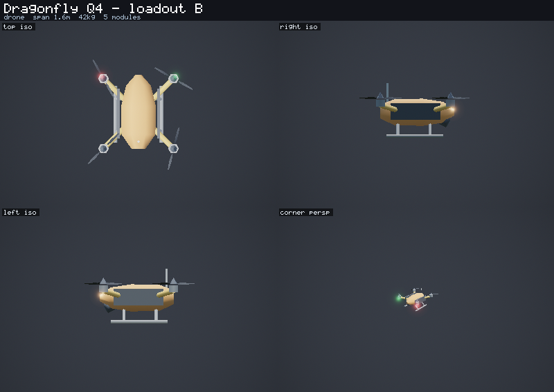

Drone, span 1.6 m, 42 kg; fits: Sprint Turbine, Lumen Emitter, Censer Pod, Ghost Box, Storm Shroud

`airframe_dragonfly_2` · raster · 800x566 · ssaa 1 · 1 sample · **39.1 ms (~25.6 fps)**

### Marshal P7 (stock)

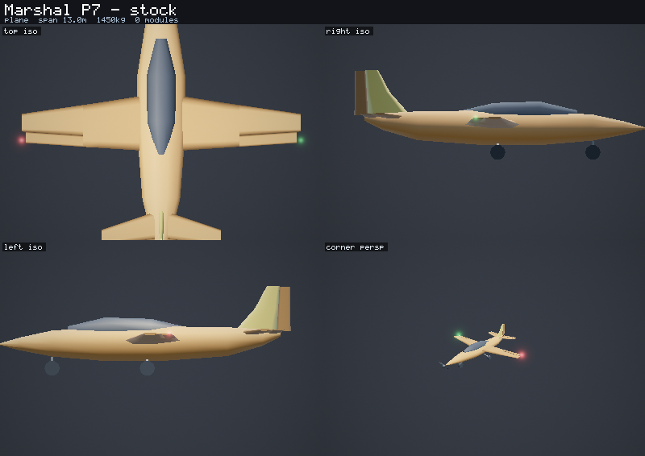

Plane, span 13.0 m, 1450 kg; fits: as delivered

`airframe_marshal_0` · raster · 800x566 · ssaa 1 · 1 sample · **43.2 ms (~23.2 fps)**

### Marshal P7 (loadout A)

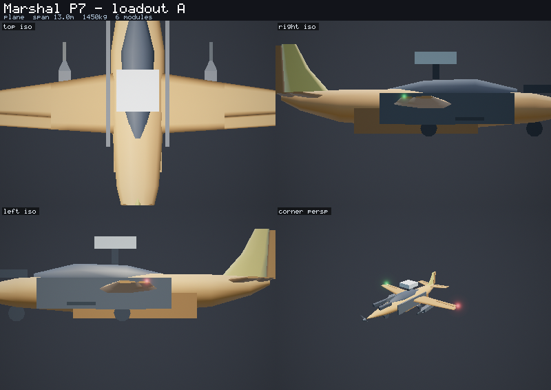

Plane, span 13.0 m, 1450 kg; fits: Tuned Engine, Extended Wings, Gun Pod, Cargo Racks, Radar Array, Armor Plating

`airframe_marshal_1` · raster · 800x566 · ssaa 1 · 1 sample · **46.7 ms (~21.4 fps)**

### Marshal P7 (loadout B)


Plane, span 13.0 m, 1450 kg; fits: Sprint Turbine, Salvage Grapple, Lumen Emitter, Censer Pod, Ghost Box, Storm Shroud

`airframe_marshal_2` · raster · 800x566 · ssaa 1 · 1 sample · **44.0 ms (~22.7 fps)**

### Pilgrim S2 (stock)

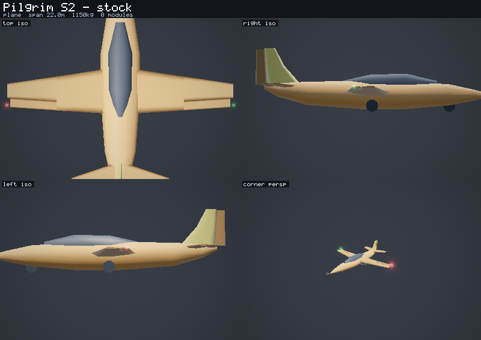

Plane, span 22.0 m, 1150 kg; fits: as delivered

`airframe_pilgrim_0` · raster · 800x566 · ssaa 1 · 1 sample · **43.0 ms (~23.2 fps)**

### Pilgrim S2 (loadout A)

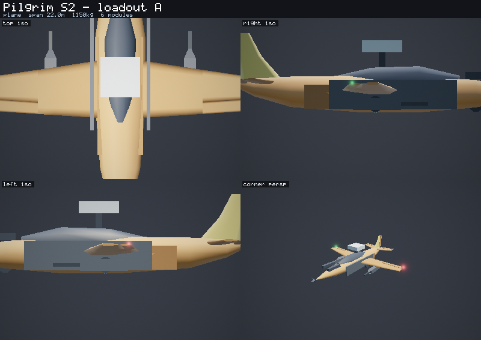

Plane, span 22.0 m, 1150 kg; fits: Tuned Engine, Extended Wings, Gun Pod, Cargo Racks, Radar Array, Armor Plating

`airframe_pilgrim_1` · raster · 800x566 · ssaa 1 · 1 sample · **54.1 ms (~18.5 fps)**

### Pilgrim S2 (loadout B)

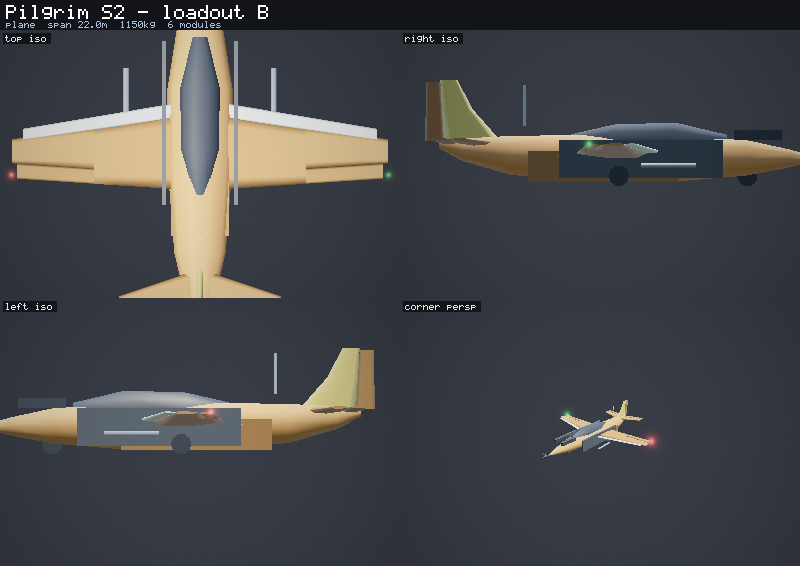

Plane, span 22.0 m, 1150 kg; fits: Sprint Turbine, Salvage Grapple, Lumen Emitter, Censer Pod, Ghost Box, Storm Shroud

`airframe_pilgrim_2` · raster · 800x566 · ssaa 1 · 1 sample · **44.3 ms (~22.6 fps)**

### Skylark T1 (stock)

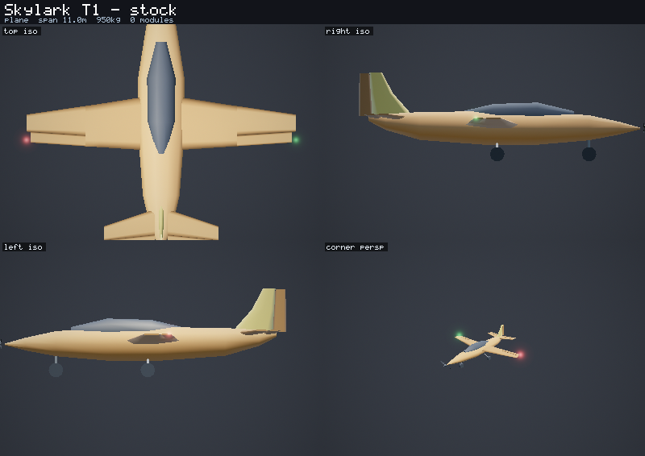

Plane, span 11.0 m, 950 kg; fits: as delivered

`airframe_skylark_0` · raster · 800x566 · ssaa 1 · 1 sample · **41.7 ms (~24.0 fps)**

### Skylark T1 (loadout A)

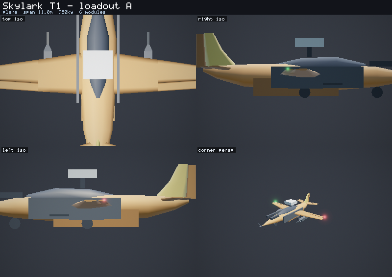

Plane, span 11.0 m, 950 kg; fits: Tuned Engine, Extended Wings, Gun Pod, Cargo Racks, Radar Array, Armor Plating

`airframe_skylark_1` · raster · 800x566 · ssaa 1 · 1 sample · **44.5 ms (~22.5 fps)**

### Skylark T1 (loadout B)

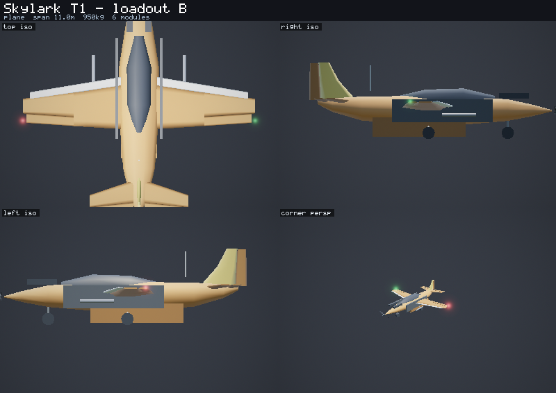

Plane, span 11.0 m, 950 kg; fits: Sprint Turbine, Salvage Grapple, Lumen Emitter, Censer Pod, Ghost Box, Storm Shroud

`airframe_skylark_2` · raster · 800x566 · ssaa 1 · 1 sample · **43.7 ms (~22.9 fps)**

### Slagback K9 (stock)


Plane, span 18.0 m, 3100 kg; fits: as delivered

`airframe_slagback_0` · raster · 800x566 · ssaa 1 · 1 sample · **42.3 ms (~23.6 fps)**

### Slagback K9 (loadout A)


Plane, span 18.0 m, 3100 kg; fits: Tuned Engine, Extended Wings, Gun Pod, Cargo Racks, Radar Array, Armor Plating

`airframe_slagback_1` · raster · 800x566 · ssaa 1 · 1 sample · **44.4 ms (~22.5 fps)**

### Slagback K9 (loadout B)


Plane, span 18.0 m, 3100 kg; fits: Sprint Turbine, Salvage Grapple, Lumen Emitter, Censer Pod, Ghost Box, Storm Shroud

`airframe_slagback_2` · raster · 800x566 · ssaa 1 · 1 sample · **43.7 ms (~22.9 fps)**

### Vulture R3 (stock)


Plane, span 7.8 m, 690 kg; fits: as delivered

`airframe_vulture_0` · raster · 800x566 · ssaa 1 · 1 sample · **41.9 ms (~23.9 fps)**

### Vulture R3 (loadout A)

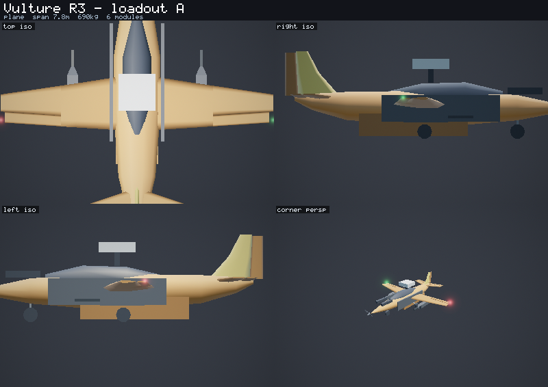

Plane, span 7.8 m, 690 kg; fits: Tuned Engine, Extended Wings, Gun Pod, Cargo Racks, Radar Array, Armor Plating

`airframe_vulture_1` · raster · 800x566 · ssaa 1 · 1 sample · **44.0 ms (~22.7 fps)**

### Vulture R3 (loadout B)

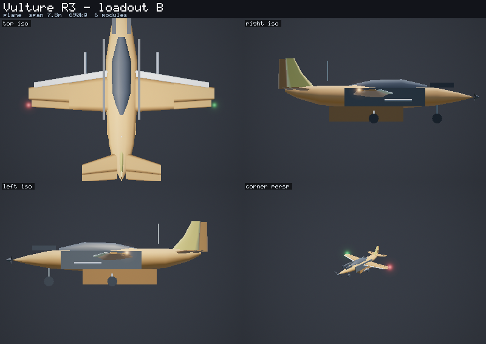

Plane, span 7.8 m, 690 kg; fits: Sprint Turbine, Salvage Grapple, Lumen Emitter, Censer Pod, Ghost Box, Storm Shroud

`airframe_vulture_2` · raster · 800x566 · ssaa 1 · 1 sample · **44.3 ms (~22.6 fps)**

### Wasp V2 (stock)

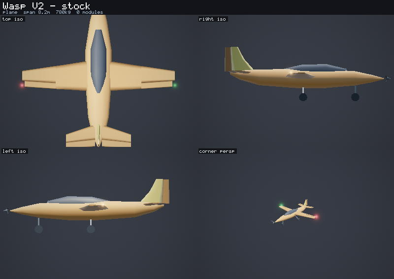

Plane, span 8.2 m, 780 kg; fits: as delivered

`airframe_wasp_0` · raster · 800x566 · ssaa 1 · 1 sample · **42.8 ms (~23.4 fps)**

### Wasp V2 (loadout A)

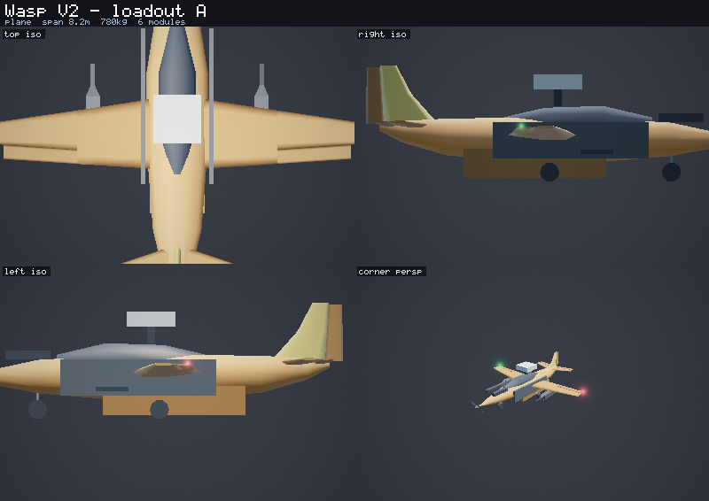

Plane, span 8.2 m, 780 kg; fits: Tuned Engine, Extended Wings, Gun Pod, Cargo Racks, Radar Array, Armor Plating

`airframe_wasp_1` · raster · 800x566 · ssaa 1 · 1 sample · **44.0 ms (~22.7 fps)**

### Wasp V2 (loadout B)

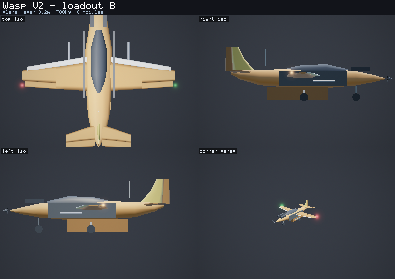

Plane, span 8.2 m, 780 kg; fits: Sprint Turbine, Salvage Grapple, Lumen Emitter, Censer Pod, Ghost Box, Storm Shroud

`airframe_wasp_2` · raster · 800x566 · ssaa 1 · 1 sample · **43.6 ms (~22.9 fps)**


## Renderer features

One vista as the rasterizer draws it, then the same vista with a single
part of the renderer moved, so what that part is worth can be seen rather
than argued about. The sun shafts need towers to cast them, so that pair
is shot over a city instead.

### Baseline


The raster frame every change below is measured against

`feature_base` · raster · 960x540 · ssaa 1 · 1 sample · **1454.7 ms (~0.7 fps)**

### Post chain, off

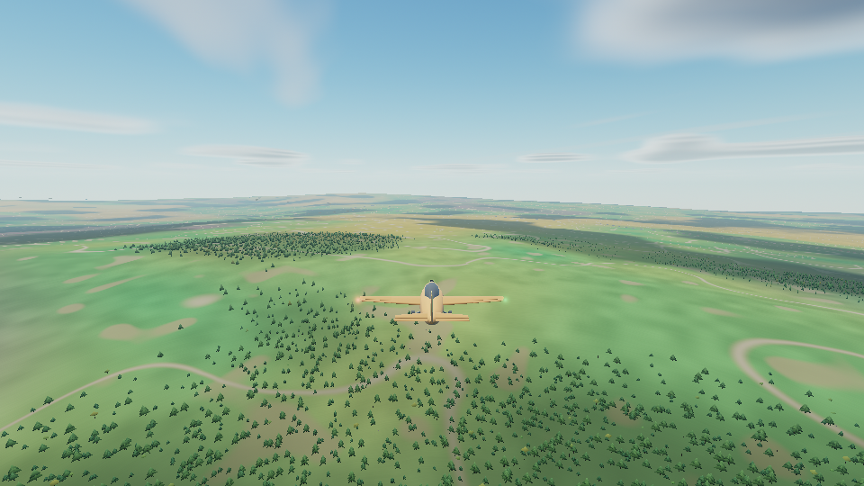

The baseline with no tonemap, no bloom, no vignette

`feature_post_off` · raster · 960x540 · ssaa 1 · 1 sample · **824.5 ms (~1.2 fps)**

### Terrain detail, low

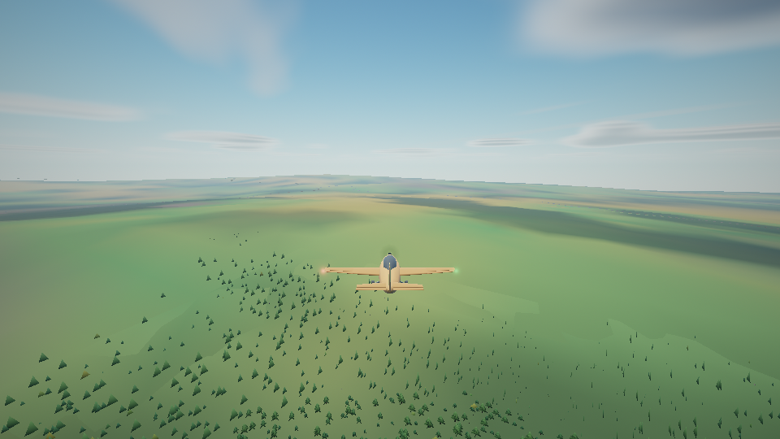

Sparse mesh, no shadows

`feature_detail_low` · raster · 960x540 · ssaa 1 · 1 sample · **366.4 ms (~2.7 fps)**

### Terrain detail, high

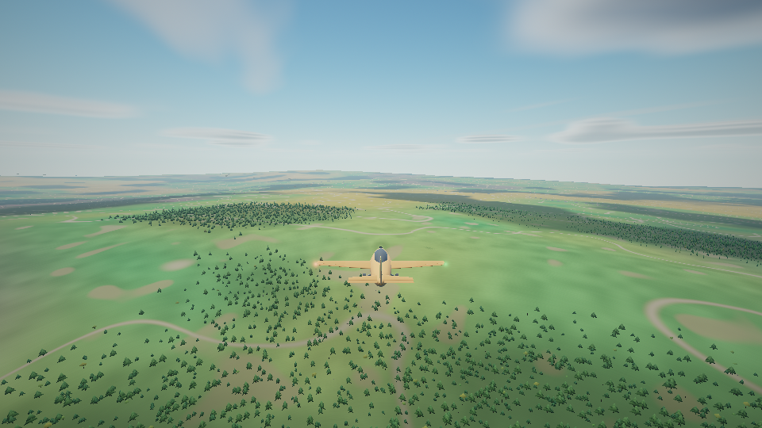

Dense mesh, near and far shadows

`feature_detail_high` · raster · 960x540 · ssaa 1 · 1 sample · **985.2 ms (~1.0 fps)**

### Supersampling

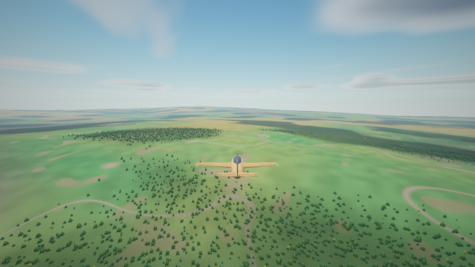

The baseline shaded at twice the resolution and resolved down

`feature_ssaa` · raster · 960x540 · ssaa 2 · 1 sample · **3193.0 ms (~0.3 fps)**

### Sun shafts, off

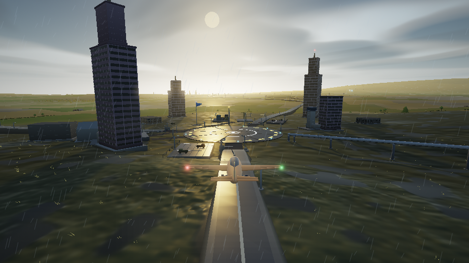

The air in the towers' shadow is lit like the air beside it

`feature_shafts_off` · raster · 960x540 · ssaa 1 · 1 sample · **1489.7 ms (~0.7 fps)**

### Sun shafts, on


The same frame with the air marched against the shadow map: the term only removes light, so the beams are what is left standing

`feature_shafts_on` · raster · 960x540 · ssaa 1 · 1 sample · **1243.5 ms (~0.8 fps)**


## Screens

Every screen the game has, drawn by the same immediate-mode UI as the
instruments. One frame per screen, in the order a player meets them.

### Splash

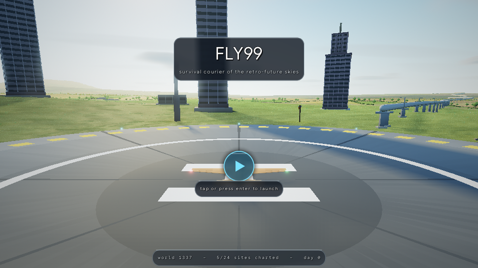

The front door and its Play button

`ui_splash` · hybrid · 960x540 · ssaa 1 · 1 sample · **13153.9 ms (~0.1 fps)**

### Play

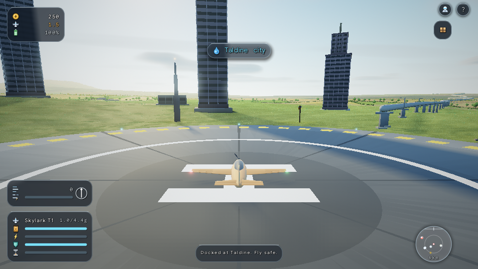

The world and the HUD, docked at home

`ui_play` · hybrid · 960x540 · ssaa 1 · 1 sample · **12733.0 ms (~0.1 fps)**

### Self

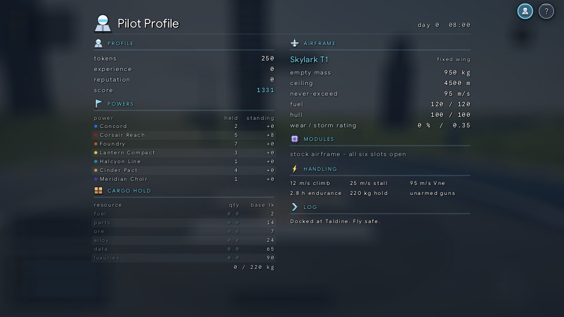

Pilot record, cargo and loadout

`ui_self` · hybrid · 960x540 · ssaa 1 · 1 sample · **43.9 ms (~22.8 fps)**

### Guide

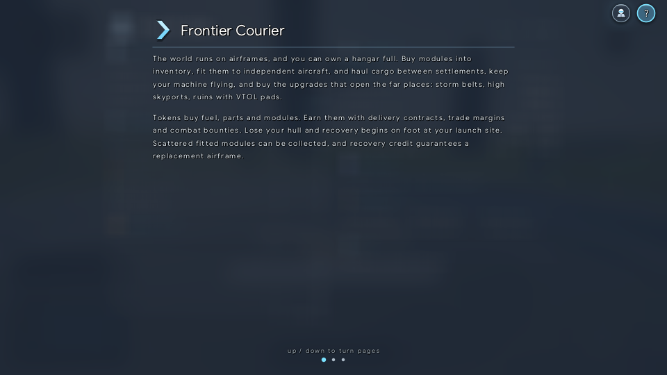

The pages that explain the game

`ui_help` · hybrid · 960x540 · ssaa 1 · 1 sample · **42.4 ms (~23.6 fps)**

### Actions

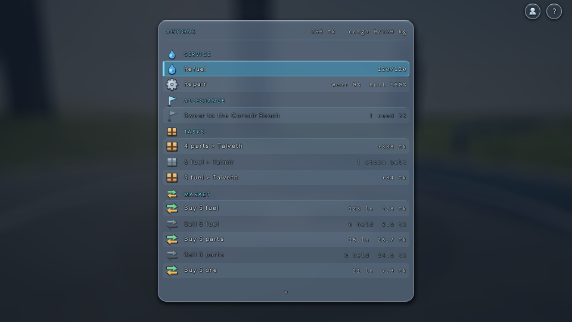

Contracts, market, upgrades and navigation

`ui_actions` · hybrid · 960x540 · ssaa 1 · 1 sample · **12628.9 ms (~0.1 fps)**

### Hangar

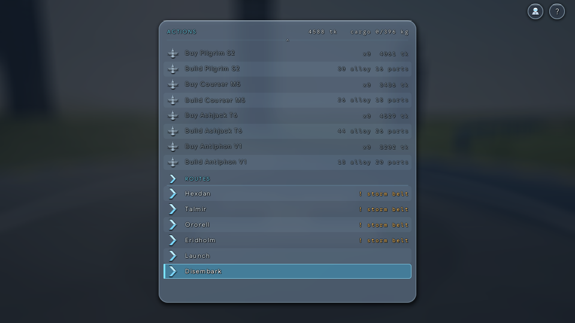

Module inventory, and the market's buy and fit rows

`ui_hangar` · hybrid · 960x540 · ssaa 1 · 1 sample · **12903.8 ms (~0.1 fps)**

### Chart

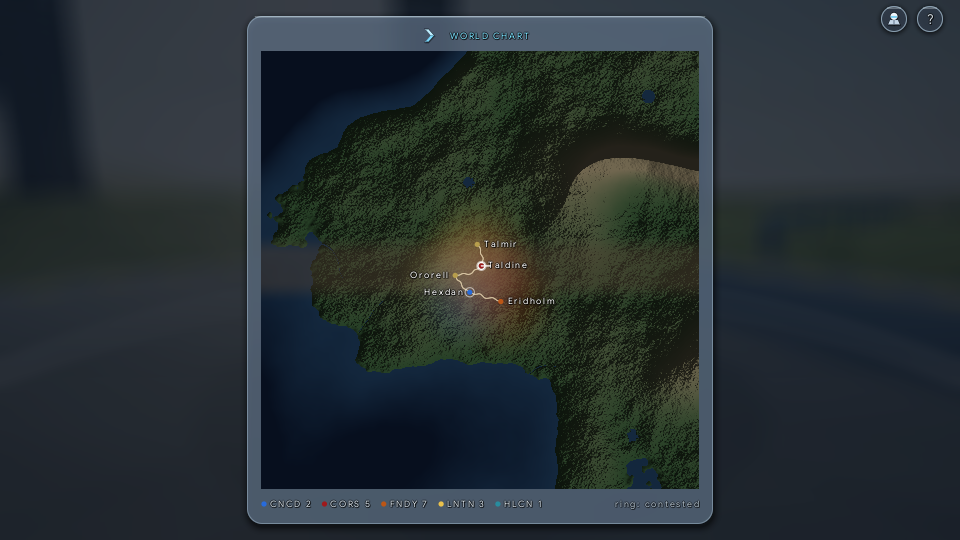

Settlements, storm belt and routes

`ui_map` · hybrid · 960x540 · ssaa 1 · 1 sample · **12885.5 ms (~0.1 fps)**

### Grounded

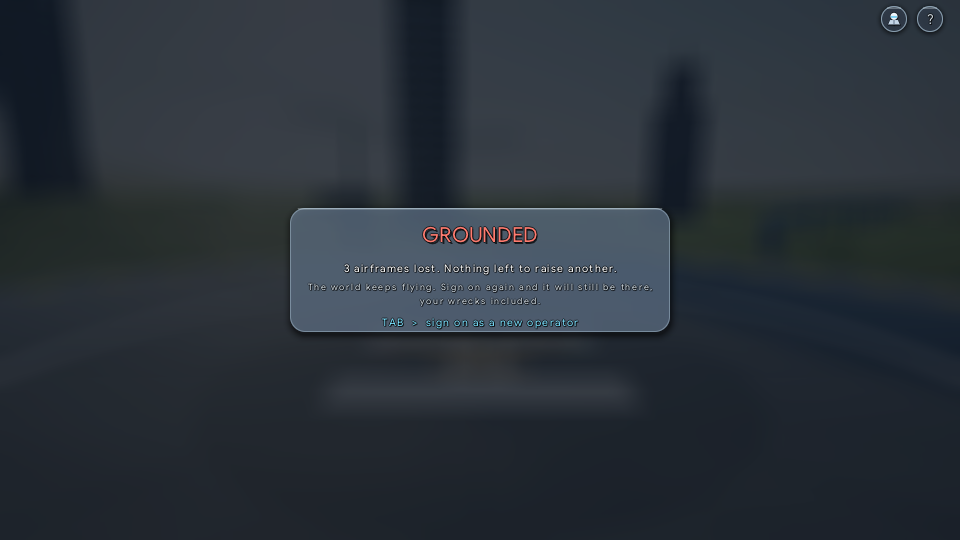

The run is over, the world is not

`ui_grounded` · hybrid · 960x540 · ssaa 1 · 1 sample · **12819.0 ms (~0.1 fps)**

### Sign-on

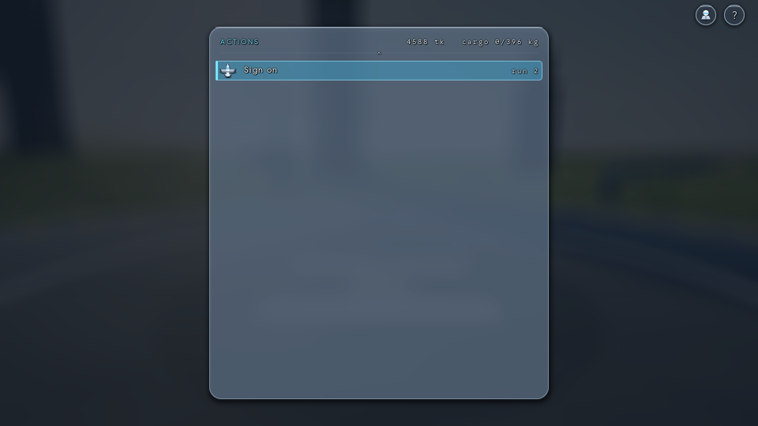

A new operator takes the seat

`ui_signon` · hybrid · 960x540 · ssaa 1 · 1 sample · **12604.3 ms (~0.1 fps)**


## Frame costs

The same small frame through each pipeline and sample count, for the
shape of the cost curve rather than an absolute number.

### Raster

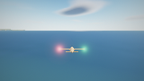

The bench frame with nothing traced

`bench_raster` · raster · 160x90 · ssaa 1 · 1 sample · **465.7 ms (~2.1 fps)**

### Hybrid

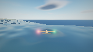

Traced environment over raster geometry, 1 sample per pixel

`bench_hybrid` · hybrid · 160x90 · ssaa 1 · 1 sample · **377.2 ms (~2.7 fps)**

### Path traced, 1 sample

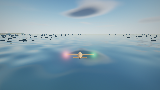

The same frame integrated once per pixel

`bench_pt_s1` · path-traced · 160x90 · ssaa 1 · 1 sample · **288.0 ms (~3.5 fps)**

### Path traced, 2 samples

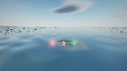

Twice the rays, half the noise

`bench_pt_s2` · path-traced · 160x90 · ssaa 1 · 2 samples · **699.4 ms (~1.4 fps)**

### Path traced, 4 samples

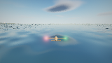

Four times the rays, and four times the cost

`bench_pt_s4` · path-traced · 160x90 · ssaa 1 · 4 samples · **1207.1 ms (~0.8 fps)**


## Diagnostic captures

Frames a correctness check rendered on its way to an assertion. A failing
number is easier to read beside the pixels it came from. Nothing here
repeats a frame from the sections above: these are diagnostics.

### Rotor, idle


The blades themselves, stopped

`craft_rotor_idle` · 240x160 · captured by a correctness check

### Rotor, spinning


The disc the blur pass draws at full throttle

`craft_rotor_spun` · 240x160 · captured by a correctness check

### Open ground

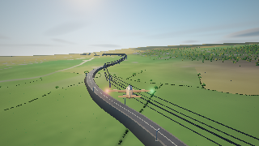

The same ground with none

`world_open` · 320x180 · captured by a correctness check

### Woodland

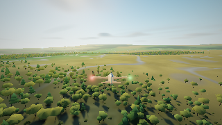

The same ground with its trees

`world_wood` · 320x180 · captured by a correctness check

### Canopy

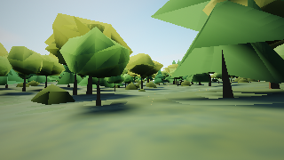

Woodland from above, measured for tonal spread rather than area

`world_canopy` · 320x180 · captured by a correctness check

### City facades

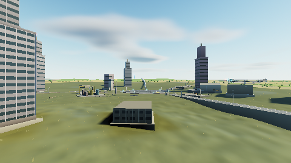

Glazing, precast panel and metal cladding, measured for how much of it moves when the sun crosses

`city_facade` · 480x270 · captured by a correctness check

### Meadow

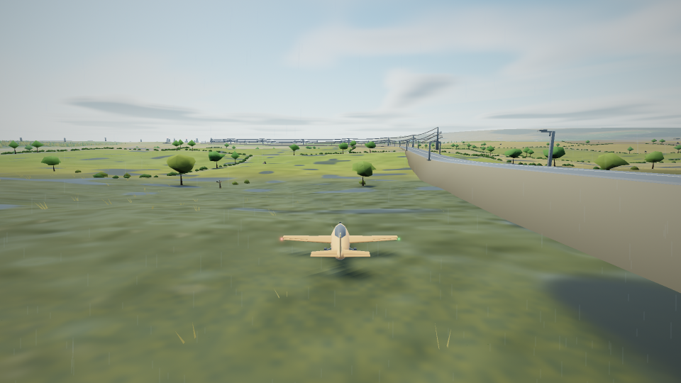

The blade layer at eye height, where its density is checked

`world_meadow` · 960x540 · captured by a correctness check

### Terminator

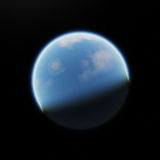

The planet from outside its air, day meeting night

`space_dawn` · 160x160 · captured by a correctness check

### Limb


The atmosphere edge-on, brightest just off the disc

`space_limb` · 320x320 · captured by a correctness check

### Drone panel

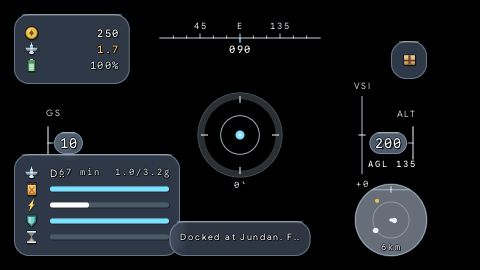

Tilt bubble and climb rate, the instruments a rotorcraft gets

`hud_drone` · 480x270 · captured by a correctness check

### Plane panel


Ladder and speed tape, the instruments an aeroplane gets

`hud_plane` · 480x270 · captured by a correctness check

### Drone in flight

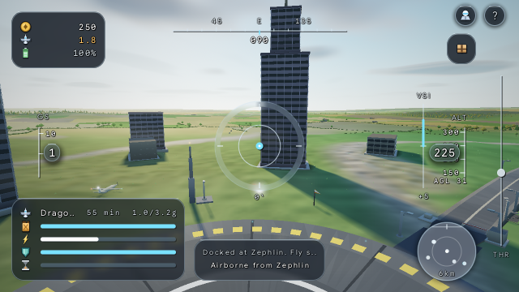

Rotorcraft instruments and touch controls, off the pad

`view_drone_flight` · 640x360 · captured by a correctness check

